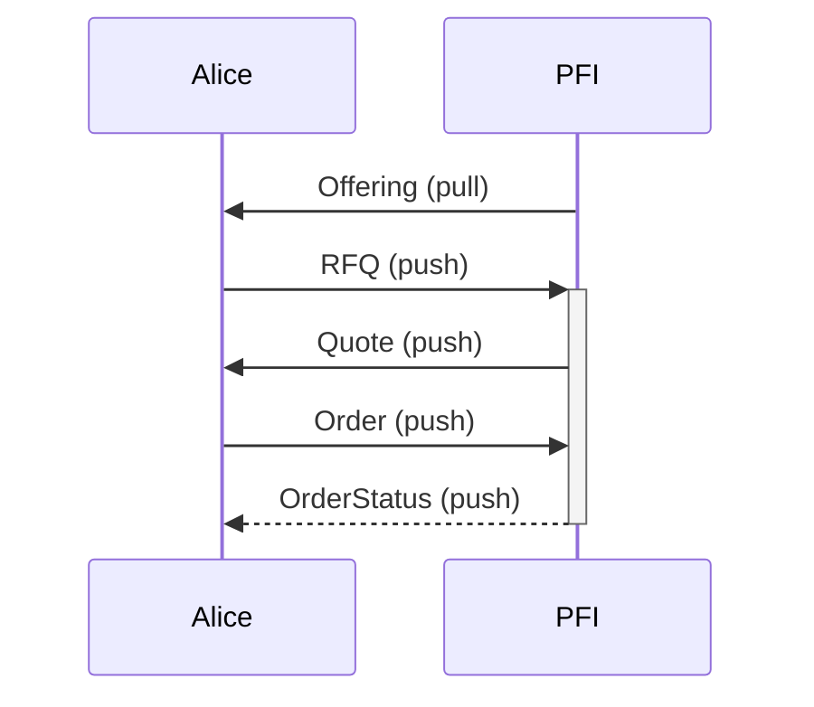

# tbDEX <!-- omit in toc -->

- [Purpose](#purpose)
- [Implementations](#implementations)
- [Test Vectors](#test-vectors)
- [Features](#features)
  - [tbDEX Message](#tbdex-message)
  - [tbDEX Resource](#tbdex-resource)
  - [tbDEX Offering Resource](#tbdex-offering-resource)
  - [tbDEX RFQ Message](#tbdex-rfq-message)
  - [tbDEX Quote Message](#tbdex-quote-message)
  - [tbDEX Order Message](#tbdex-order-message)
  - [tbDEX Order-Status Message](#tbdex-order-status-message)
  - [tbDEX Close Message](#tbdex-close-message)
  - [tbDEX Client](#tbdex-client)
  - [tbDEX Server](#tbdex-server)

## Purpose
This repo contains specifications for tbDEX

| Specification                 | Description                                                                                          | Status                               |
| ----------------------------- | ---------------------------------------------------------------------------------------------------- | ------------------------------------ |
| [Protocol](./specs/protocol/) | Defines the message and resource formats that make up the tbDEX messaging protocol                   | [Draft](./specs/protocol/#status-) |
| [HTTP API](./specs/http-api/) | Defines a REST API that can be hosted by an individual PFI that wants to provide liquidity via tbDEX | [Draft](./specs/http-api/#status-) |

For information on the development process for this protocol, check out [sdk-development](https://github.com/TBD54566975/sdk-development/)

## Implementations 

* [JavaScript/Typescript](https://github.com/TBD54566975/tbdex-js) (feature complete)
* [Kotlin](https://github.com/TBD54566975/tbdex-kt) (work in progress)
* [Example PFI implementation](https://github.com/TBD54566975/tbdex-pfi-exemplar/)

## Test Vectors
Implementations are run against a common set of [test vectors](./hosted/test-vectors/). For more information about how test vectors are used, check out the [Test Vectors](https://github.com/TBD54566975/sdk-development#test-vectors) section of the `sdk-development` readme.

## Features

### tbDEX Message

| Feature      | Typescript | Kotlin | Rust | Swift |
| ------------ | ---------- | ------ | ---- | ----- |
| Validation   | ✅         | ✅     | ❌   | ❌    |
| Signing      | ✅         | ✅     | ❌   | ❌    |
| Verification | ✅         | ✅     | ❌   | ❌    |
| Parsing      | ✅         | ✅     | ❌   | ❌    |

### tbDEX Resource

| Feature      | Typescript | Kotlin | Rust | Swift |
| ------------ | ---------- | ------ | ---- | ----- |
| Validation   | ✅          | ✅      | ❌    | ❌     |
| Signing      | ✅          | ✅      | ❌    | ❌     |
| Verification | ✅          | ✅      | ❌    | ❌     |
| Parsing      | ✅          | ✅      | ❌    | ❌     |

### tbDEX Offering Resource

| Feature      | Typescript | Kotlin | Rust | Swift |
| ------------ | ---------- | ------ | ---- | ----- |
| Creation     | ✅          | ✅      | ❌    | ❌     |
| Validation   | ✅          | ✅      | ❌    | ❌     |
| Signing      | ✅          | ✅      | ❌    | ❌     |
| Verification | ✅          | ✅      | ❌    | ❌     |
| Parsing      | ✅          | ✅      | ❌    | ❌     |

### tbDEX RFQ Message

| Feature      | Typescript | Kotlin | Rust | Swift |
| ------------ | ---------- | ------ | ---- | ----- |
| Creation     | ✅          | ✅      | ❌    | ❌     |
| Validation   | ✅          | ✅      | ❌    | ❌     |
| Signing      | ✅          | ✅      | ❌    | ❌     |
| Verification | ✅          | ✅      | ❌    | ❌     |
| Parsing      | ✅          | ✅      | ❌    | ❌     |

### tbDEX Quote Message

| Feature      | Typescript | Kotlin | Rust | Swift |
| ------------ | ---------- | ------ | ---- | ----- |
| Creation     | ✅          | ✅      | ❌    | ❌     |
| Validation   | ✅          | ✅      | ❌    | ❌     |
| Signing      | ✅          | ✅      | ❌    | ❌     |
| Verification | ✅          | ✅      | ❌    | ❌     |
| Parsing      | ✅          | ✅      | ❌    | ❌     |

### tbDEX Order Message

| Feature      | Typescript | Kotlin | Rust | Swift |
| ------------ | ---------- | ------ | ---- | ----- |
| Creation     | ✅          | ✅      | ❌    | ❌     |
| Validation   | ✅          | ✅      | ❌    | ❌     |
| Signing      | ✅          | ✅      | ❌    | ❌     |
| Verification | ✅          | ✅      | ❌    | ❌     |
| Parsing      | ✅          | ✅      | ❌    | ❌     |

### tbDEX Order-Status Message

| Feature      | Typescript | Kotlin | Rust | Swift |
| ------------ | ---------- | ------ | ---- | ----- |
| Creation     | ✅          | ✅      | ❌    | ❌     |
| Validation   | ✅          | ✅      | ❌    | ❌     |
| Signing      | ✅          | ✅      | ❌    | ❌     |
| Verification | ✅          | ✅      | ❌    | ❌     |
| Parsing      | ✅          | ✅      | ❌    | ❌     |

### tbDEX Close Message

| Feature      | Typescript | Kotlin | Rust | Swift |
| ------------ | ---------- | ------ | ---- | ----- |
| Creation     | ✅          | ✅      | ❌    | ❌     |
| Validation   | ✅          | ✅      | ❌    | ❌     |
| Signing      | ✅          | ✅      | ❌    | ❌     |
| Verification | ✅          | ✅      | ❌    | ❌     |
| Parsing      | ✅          | ✅      | ❌    | ❌     |

### tbDEX Client

| Feature       | Typescript | Kotlin | Rust | Swift |
| ------------- | ---------- | ------ | ---- | ----- |
| Send Message  | ✅          | ✅      | ❌    | ❌     |
| Get Exchange  | ✅          | ✅      | ❌    | ❌     |
| Get Exchanges | ✅          | ✅      | ❌    | ❌     |
| Get Offerings | ✅          | ✅      | ❌    | ❌     |

### tbDEX Server

| Feature               | Typescript | Kotlin | Rust | Swift |
| --------------------- | ---------- | ------ | ---- | ----- |
| Get Exchange Handler  | ✅          | ❌      | ❌    | ❌     |
| Get Exchanges Handler | ✅          | ❌      | ❌    | ❌     |
| Get Offerings Handler | ✅          | ❌      | ❌    | ❌     |
| Submit RFQ Handler    | ✅          | ❌      | ❌    | ❌     |
| Submit Order Handler  | ✅          | ❌      | ❌    | ❌     |
| Submit Close Handler  | ✅          | ❌      | ❌    | ❌     |
