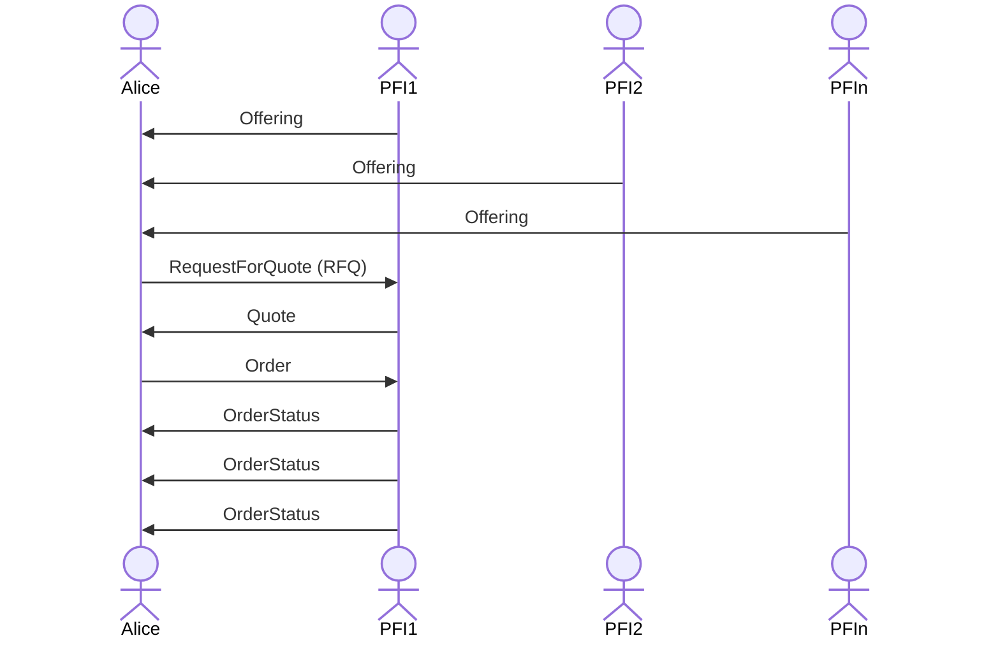

# tbDEX Protocol <!-- omit in toc -->


# Introduction <!-- omit in toc -->
tbDEX is a protocol for discovering liquidity and exchanging assets (such as fiat money, real world goods, stablecoins or bitcoin) when the existence of social trust is an intractable element of managing transaction risk. The tbDEX protocol facilitates decentralized networks of exchange between assets by providing a framework for establishing social trust, utilizing decentralized identity (DID) and verifiable credentials (VCs) to establish the provenance of identity in the real world. The protocol has no opinion on anonymity as a feature or consequence of transactions. Instead, it allows willing counterparties to negotiate and establish the minimum information acceptable for the exchange. Moreover, it provides the infrastructure necessary to create a ubiquity of on-ramps and off-ramps directly between the fiat and decentralized financial systems without the need for centralized intermediaries and trust brokers. This makes digital currencies and decentralized financial services more accessible to everyone.

This specification defines the message and resource formats that make up the tbDEX messaging protocol which is composed of two key concepts: [_Resources_](#resources) and [_Messages_](#messages).

# Status <!-- omit in toc -->
Version: Draft

> [!NOTE]
> 
> This specification will continue to be in a **Draft** state until there are two separate PFIs deployed and providing liquidity to individuals or other institutions

> [!WARNING]
>
> This repo is currently under construction 🚧. The protocol specified in this README and the [RESTful API specification](./rest-api) are up to date but the [`js`](./js) lib is not. We'll be moving that to its own repo within the coming days. This repo will be repurposed to house specifications only. 

- [Resources](#resources)
  - [Resource Kinds](#resource-kinds)
    - [`Offering`](#offering)
      - [`CurrencyDetails`](#currencydetails)
      - [`PaymentMethod`](#paymentmethod)
      - [Example](#example)
    - [`Reputation`](#reputation)
- [Messages](#messages)
  - [Fields](#fields)
    - [`metadata`](#metadata)
    - [`data`](#data)
    - [`private`](#private)
      - [Example Usage in RFQ message](#example-usage-in-rfq-message)
    - [`signature`](#signature)
      - [Header](#header)
        - [Supported `alg`s](#supported-algs)
      - [Payload](#payload)
  - [ID generation](#id-generation)
  - [Hashing](#hashing)
    - [Rationale](#rationale)
      - [Why CBOR?](#why-cbor)
      - [Why SHA256?](#why-sha256)
      - [Why Base64?](#why-base64)
  - [Message Kinds](#message-kinds)
    - [`RFQ (Request For Quote)`](#rfq-request-for-quote)
      - [`SelectedPaymentMethod`](#selectedpaymentmethod)
    - [`Close`](#close)
    - [`Quote`](#quote)
      - [`QuoteDetails`](#quotedetails)
      - [`PaymentInstructions`](#paymentinstructions)
      - [`PaymentInstruction`](#paymentinstruction)
    - [`Order`](#order)
    - [`OrderStatus`](#orderstatus)
- [tbDEX conversation sequence](#tbdex-conversation-sequence)
- [Jargon Decoder](#jargon-decoder)
- [Resources](#resources-1)

# Resources
tbDEX Resources are published by PFIs for anyone to consume and generally used as a part of the discovery process. They are not part of the message exchange, i.e Alice cannot reply to a Resource.

## Resource Kinds

### `Offering`
An `Offering` is used by the PFI to describe a currency pair they have to _offer_ including the requirements, conditions, and constraints in order to fulfill that offer.

> PFI -> world: "Here are the currency pairs i have to offer. These are the constraints of my offer in terms of how much you can buy, what credentials I need from you, and what payment methods you can use to pay me the base currency, and what payment methods I can use to pay you the quote currency."

| field                   | data type                             | required | description                                                                                                                          |
| ----------------------- | ------------------------------------- | -------- | ------------------------------------------------------------------------------------------------------------------------------------ |
| `id`                    | string                                | Y        | Unique identifier for this offering                                                                                                  |
| `description`           | string                                | Y        | Brief description of what is being offered.                                                                                          |
| `quoteUnitsPerBaseUnit` | string                                | Y        | Number of quote units on offer for one base currency unit (i.e 290000 USD for 1 BTC                                                  |
| `baseCurrency`          | [`CurrencyDetails`](#currencydetails) | Y        | Details about the currency that the PFI is selling.                                                                                  |
| `quoteCurrency`         | [`CurrencyDetails`](#currencydetails) | Y        | Details about the currency that the PFI is accepting as payment for `baseCurrency`.                                                  |
| `vcRequirements`        | string                                | Y        | PresentationDefinition in JWT string format which describes the credential(s) needed to choose this offer.                           |
| `payinMethods`          | [`PaymentMethod[]`](#paymentmethod)   | Y        | A list of payment methods the counterparty (Alice) can choose to send payment to the PFI from in order to qualify for this offering. |
| `payoutMethods`         | [`PaymentMethod[]`](#paymentmethod)   | Y        | A list of payment methods the counterparty (Alice) can choose to receive payment from the PFI in order to qualify for this offering. |
| `createdAt`             | datetime                              | Y        | The creation time of the resource. Expressed as ISO8601                                                                              |

#### `CurrencyDetails`
| field          | data type | required | description                                            |
| -------------- | --------- | -------- | ------------------------------------------------------ |
| `currencyCode` | string    | Y        | ISO 3166 currency code string                          |
| `minSubunits`  | string    | N        | Minimum amount of currency that the offer is valid for |
| `maxSubunits`  | string    | N        | Maximum amount of currency that the offer is valid for |

#### `PaymentMethod`
| field                    | data type                               | required | description                                                                                       |
| ------------------------ | --------------------------------------- | -------- | ------------------------------------------------------------------------------------------------- |
| `kind`                   | string                                  | Y        | Type of payment method (i.e. `DEBIT_CARD`, `BITCOIN_ADDRESS`, `SQUARE_PAY`)                       |
| `requiredPaymentDetails` | [JSON Schema](https://json-schema.org/) | N        | A JSON Schema containing the fields that need to be collected in order to use this payment method |
| `feeSubunits`            | string                                  | N        | The fee expressed in the quote currency's sub units to make use of this payment method            |


#### Example
```json
{
  "id": "tbdex:offering:123456",
  "description": "Buy BTC with USD!",
  "quoteUnitsPerBaseUnit": "29000",
  "baseCurrency": {
    "currencyCode" : "BTC",
  },
  "quoteCurrency":  {
    "currencyCode" : "USD",
    "minSubunits"  : "1000",
    "maxSubunits"  : "1000"
  },
  "vcRequirements": "eyJhb...MIDw",
  "payinMethods": [{
    "kind": "DEBIT_CARD",
    "requiredPaymentDetails": "eyJhb...MIDw",
    "feeSubunits": "100"
  },
  {
    "kind": "SQUARE_PAY",
    "feeSubunits": "100"
  }],
  "payoutMethods": [{
    "kind": "BTC_ADDRESS",
    "requiredPaymentDetails": {
      "$schema": "http://json-schema.org/draft-07/schema#",
      "title": "BTC Required Payment Details",
      "type": "object",
      "required": [
        "btcAddress"
      ],
      "additionalProperties": false,
      "properties": {
        "btcAddress": {
	      "description": "The address you wish to receive BTC in",
	      "type": "string"
	      }
      }
    }
    "feeSubunits": "100"
  }],
  "createdAt": "2023-06-23T11:23:41Z"
}
```

### `Reputation`
A set of Verifiable Credentials _issued_ to the PFI that can be consumed by any interested party in order to assess the reputability of the respective PFI.

> [!NOTE]
> TODO: Fill out

# Messages
Messages form exchanges between Alice and a PFI. 

## Fields
All tbdex messages are JSON objects which can include the following top-level properties:

| Field       | Required (Y/N) | Description                                                           |
| ----------- | -------------- | --------------------------------------------------------------------- |
| `metadata`  | Y              | An object containing fields _about_ the message                       |
| `data`      | Y              | The actual message content                                            |
| `signature` | Y              | signature that verifies the authenticity and integrity of the message |
| `private`   | N              | An ephemeral JSON object used to transmit sensitive data (e.g. PII)   |

### `metadata`
The `metadata` object contains fields _about_ the message and is present in _every_ tbdex message. 


| Field       | Required (Y/N) | Description                                                                               |
| ----------- | -------------- | ----------------------------------------------------------------------------------------- |
| `from`      | Y              | The sender's DID                                                                          |
| `to`        | Y              | the recipient's DID                                                                       |
| `kind`      | Y              | e.g. `rfq`, `quote` etc. This defines the `data` property's _type_                        |
| `id`        | Y              | The message's ID                                                                          |
| `threadId`  | Y              | ID for a "thread" of messages between Alice <-> PFI. Set by the first message in a thread |
| `parentId`  | N              | the ID of the most recent message in a thread. `null` for the first message in a thread   |
| `createdAt` | Y              | ISO 8601                                                                                  |


### `data`
The actual message content. This will _always_ be a JSON object. 


### `private`
Often times, an RFQ will contain PII or PCI data either within the `credentials` being presented or within `paymentDetails` of `payinMethod` or `payoutMethod` (e.g. card details, phone numbers, full names etc). 

In order to prevent storing this sensitive data with the message itself, the value of a property containing sensitive data can be a [hash](#Hashing) of the sensitive data. The actual sensitive data itself is included in the `private` field. 

The `private` field is ephemeral and **MUST** only be present when the message is initially sent to the intended recipient

The value of `private` **MUST** be a JSON object that matches the structure of `data`. The properties present within `private` **MUST** only be the properties of `data` that include the hash counterpart.

> **Note**
> Rationale behind the `private` JSON object matching the structure of `data` is to simplify programmatic hash evaluation using JSONPath to pluck the respective hash from `data`. **NOTE**: we should try this to make sure it's actually "easy"

#### Example Usage in RFQ message

```json
{
  "data": {
    "offeringId": <OFFERING_ID>,
    "quoteAmountSubunits": "STR_VALUE",
    "vcs": <PRESENTATION_SUBMISSION_HASH>, <---- hash
    "payinMethod": {
      "kind": "BTC_ADDRESS",
      "paymentDetails": <OBJ_HASH> <---- hash
    },
    "payoutMethod": {
      "kind": "MOMO_MPESA",
      "paymentDetails": <OBJ_HASH> <---- hash
    }
  },
  "private": {
    "vcs": <PRESENTATION_SUBMISSION>, <---- actual
    "payinMethod": {
      "paymentDetails": <OBJ> <---- actual
    },
    "payoutMethod": {
      "paymentDetails": <OBJ> <---- actual
    }
  }
}
```


### `signature`
The `signature` property's value is a compact [JWS](https://datatracker.ietf.org/doc/html/rfc7515)

#### Header
The JWS header **MUST** contain the following properties:


| Field | Description                                                                    |
| ----- | ------------------------------------------------------------------------------ |
| `alg` | [Reference](https://datatracker.ietf.org/doc/html/rfc7515#section-4.1.1)       |
| `kid` | the `id` of the DID Doc`verificationMethod` that can be used to verify the JWS |

##### Supported `alg`s
* `EdDSA` - Edwards-curve Digital Signature Algorithm. Ed25519
* `ES256K` - AKA secp256k1. Well known for its use in Bitcoin 


#### Payload
The Payload is a JSON object and **MUST** contain the following:


| Field      | Description                    |
| ---------- | ------------------------------ |
| `metadata` | [Hash](#Hashing) of `metadata` |
| `data`     | [Hash](#Hashing) `data`        |


## ID generation
Currently, tbdex message IDs are [TypeIDs](https://github.com/jetpack-io/typeid) generated by the sender. The prefix for a given id **MUST** be the same as `metadata.kind` of the message

> **Note**
> TODO: Discuss using `prefix_$(sha256(cbor(message)))` as the ID as an alternative


## Hashing
TL;DR:
```
base64Encode(
  sha256(
    cbor(json)
  )
)
```

1. **CBOR Encode the JSON Object**: take your JSON object and encode it using CBOR. This step produces a binary representation of your JSON object.
2. **SHA256 the Bytes**: Hash the CBOR-encoded byte sequence using SHA256. This produces a fixed-size (256-bit) hash.
3. **Base64 Encode the Hash**: Finally, to represent the hash in a text format (for easier sharing, storage, etc.), Base64 encode the SHA256 hash bytes.


### Rationale

#### Why CBOR?

Benefits:
* **Deterministic Serialization**: JSON serialization libraries can sometimes produce non-deterministic results, especially when it comes to the ordering of keys in objects. This could result in the same logical object having different serialized representations. CBOR, by contrast, offers deterministic serialization, ensuring that the same logical object will always produce the same binary representation.
* **Uniform Data Representation**: Some data types, such as floating-point numbers, can have multiple valid representations in JSON (e.g., 1.0 vs. 1). CBOR can offer a more consistent representation of these types.

Trade-offs:
* **Complexity**: Additional complexity & dependencies to encode CBOR
* **Performance**: While CBOR might be more space-efficient, the act of converting JSON to CBOR introduces an additional computational step. For small objects or infrequent operations, this might be negligible, but for high-frequency operations, the conversion overhead could become noticeable.

#### Why SHA256?
* **Widely Recognized and Adopted**: SHA256, which is part of the SHA-2 (Secure Hash Algorithm 2) family, is widely recognized and adopted in various cryptographic applications and protocols. SHA256 is standardized by the National Institute of Standards and Technology (NIST) in the U.S. Being a standard means it has undergone extensive review and evaluation by experts in the field.
* **Security**: As of today, SHA256 has no known vulnerability to collision attacks, preimage attacks, or second preimage attacks. 
  * A collision attack is when two different inputs produce the same hash. 
  * A preimage attack is when, given a hash, an attacker finds an input that hashes to it. 
  * A second preimage attack is when, given an input and its hash, an attacker finds a different input that produces the same hash. 
* **Output Size**: SHA256 provides a fixed hash output of 256 bits (32 bytes). This size strikes a balance between efficiency and security

#### Why Base64?
When sending a SHA-256 hash (or any binary data) over the wire, it's common to use an encoding that translates the binary data into a set of characters that can be safely transmitted over systems that might not handle raw binary well. One of the most common encodings used for this purpose is Base64 encoding.

Base64-encoded data is safe for transmission over most protocols and systems since it only uses printable ASCII characters. Base64 Encoding/Decoding is widely supported across several programming languages.

> **Note** 
> A raw SHA256 hash is 32 bytes. When base64 encoded it becomes a 44 byte string


## Message Kinds
### `RFQ (Request For Quote)`
> Alice -> PFI: "OK, that offering looks good. Give me a Quote against that Offering, and here is how much USD (quote currency) I want to trade for BTC (base currency). Here are the credentials you're asking for, the payment method I intend to pay you USD with, and the payment method I expect you to pay me BTC in."

| field                 | data type                                         | required | description                                                                                                         |
| --------------------- | ------------------------------------------------- | -------- | ------------------------------------------------------------------------------------------------------------------- |
| `offeringId`          | string                                            | Y        | Offering which Alice would like to get a quote for                                                                  |
| `quoteAmountSubunits` | string                                            | Y        | Amount of quote currency you want to spend in order to receive base currency                                        |
| `vcs`                 | string                                            | Y        | VerifiablePresentation in JWT string format that meets the specification per PresentationDefinition in the Offering |
| `payinMethod`         | [`SelectedPaymentMethod`](#selectedpaymentmethod) | Y        | Specify which payment method to send quote currency.                                                                |
| `payoutMethod`        | [`SelectedPaymentMethod`](#selectedpaymentmethod) | Y        | Specify which payment method to receive base currency.                                                              |

#### `SelectedPaymentMethod`
| field            | data type | required | description                                                                                       |
| ---------------- | --------- | -------- | ------------------------------------------------------------------------------------------------- |
| `kind`           | string    | Y        | Type of payment method (i.e. `DEBIT_CARD`, `BITCOIN_ADDRESS`, `SQUARE_PAY`)                       |
| `paymentDetails` | object    | N        | An object containing the properties defined in an Offering's `requiredPaymentDetails` json schema |

```json
{
  "metadata": {
    "from": "did:ex:alice",
    "to": "did:ex:pfi",
    "kind": "rfq",
    "id": "abcd123",
    "threadId": <RFQ_ID>,
    "parentId": null,
    "createdAt": "ISO_8601"
  },
  "data": {
    "offeringId": <OFFERING_ID>,
    "quoteAmountSubunits": "STR_VALUE",
    "vcs": <PRESENTATION_SUBMISSION_HASH>,
    "payinMethod": {
      "kind": "BTC_ADDRESS",
      "paymentDetails": <OBJ_HASH>
    },
    "payoutMethod": {
      "kind": "MOMO_MPESA",
      "paymentDetails": <OBJ_HASH>
    }
  },
  "signature": "COMPACT_JWS",
  "private": {
    "vcs": <PRESENTATION_SUBMISSION>,
    "payinMethod": {
      "paymentDetails": <OBJ>
    },
    "payoutMethod": {
      "paymentDetails": <OBJ>
    }
  }
}
```

### `Close`
> Alice -> PFI: "Not interested anymore." or "oops sent by accident"

> PFI -> Alice: "Can't fulfill what you sent me for whatever reason (e.g. RFQ is erroneous, don't have enough liquidity etc.)"

a `Close` can be sent by Alice _or_ the PFI as a reply to an RFQ or a Quote

| Field    | Data Type | Required | Description                                      |
| -------- | --------- | -------- | ------------------------------------------------ |
| `reason` | string    | N        | an explanation of why the thread is being closed |

> **Note**
> Include a section that explains rules around when a Close can/can't be sent. Can Alice close after having sent an Order message, effectively accepting the quote?

### `Quote`
> PFI -> Alice: "OK, here's your Quote that describes how much BTC you will receive based on your RFQ. Here's the total fee in USD associated with the payment methods you selected. Here's how to pay us, and how to let us pay you, when you're ready to execute the Quote. This quote expires at X time."

| field                 | data type                                     | required | description                                                                                               |
| --------------------- | --------------------------------------------- | -------- | --------------------------------------------------------------------------------------------------------- |
| `expiresAt `          | datetime                                      | Y        | When this quote expires. Expressed as ISO8601                                                             |
| `base`                | [`QuoteDetails`](#quotedetails)               | Y        | the amount of _base_ currency that Alice will receive                                                     |
| `quote`               | [`QuoteDetails`](#quotedetails)               | Y        | the amount of _quote_ currency that the PFI will receive                                                  |
| `paymentInstructions` | [`PaymentInstructions`](#paymentinstructions) | N        | Object that describes how to pay the PFI, and how to get paid by the PFI (e.g. BTC address, payment link) |


#### `QuoteDetails`
| field            | data type | required | description                                                      |
| ---------------- | --------- | -------- | ---------------------------------------------------------------- |
| `currencyCode`   | string    | Y        | ISO 3166 currency code string                                    |
| `amountSubunits` |           | Y        | The amount of currency expressed in the smallest respective unit |
| `feeSubunits`    | string    | N        | The amount paid in fees                                          |

> **Note**
> Include a section that explains `feeSubunits`. Does `amountSubUnits` _include_ `feeSubunits` or does `amountSubunits + feeSubunits = totalSubunits`?

#### `PaymentInstructions`
| field    | data type                                   | required | description                                               |
| -------- | ------------------------------------------- | -------- | --------------------------------------------------------- |
| `payin`  | [`PaymentInstruction`](#paymentinstruction) | N        | Link or Instruction describing how to pay the PFI.        |
| `payout` | [`PaymentInstruction`](#paymentinstruction) | N        | Link or Instruction describing how to get paid by the PFI |

#### `PaymentInstruction`
| field         | data type | required | description                                                               |
| ------------- | --------- | -------- | ------------------------------------------------------------------------- |
| `link`        | String    | N        | Link to allow Alice to pay PFI, or be paid by the PFI                     |
| `instruction` | String    | N        | Instruction on how Alice can pay PFI, or how Alice can be paid by the PFI |


```json
{
  "metadata": {
    "from": "did:ex:pfi",
    "to": "did:ex:alice",
    "kind": "quote",
    "id": "abcd123",
    "threadId": <RFQ_ID>,
    "parentId": <RFQ_ID>,
    "createdAt": "ISO_8601"
  },
  "data": {
    "expiresAt": "ISO_8601",
    "paymentInstructions": null,
    "base": {
      "currencyCode": "BTC",
      "amountSubunits": "3",
      "feeSubunits": "0",
    },
    "quote": {
      "currencyCode": "USD",
      "amountSubunits": "100_00",
      "feeSubunits": "0",
    },
  },
  "signature": "COMPACT_JWS",
}
```


### `Order`
> Alice -> PFI: I'm happy with the quote and I want to execute the transaction"


```json
{
  "metadata": {
    "from": "did:ex:alice",
    "to": "did:ex:pfi",
    "kind": "order",
    "id": "abcd123",
    "threadId": <RFQ_ID>,
    "parentId": <QUOTE_ID>,
    "createdAt": "ISO_8601"
  },
  "data": {},
  "signature": "COMPACT_JWS",
}
```

### `OrderStatus`
> PFI -> Alice: "Here's the status of your order."


> **Note**
> There can be many `OrderStatus` messages in a tbdex thread. 1 for every status change that a PFI wants to inform Alice of.

| field         | data type | required | description                                   |
| ------------- | --------- | -------- | --------------------------------------------- |
| `orderStatus` | string    | Y        | Current status of Order that's being executed |


```json
{
  "metadata": {
    "from": "did:ex:pfi",
    "to": "did:ex:alice",
    "kind": "orderStatus",
    "id": "abcd123",
    "threadId": <RFQ_ID>,
    "parentId": <ORDER_ID> || <ORDER_STATUS_ID>,
    "createdAt": "ISO_8601"
  },
  "data": {
    "orderStatus": "PENDING"
  },
  "signature": "COMPACT_JWS",
}
```


# tbDEX conversation sequence



# Jargon Decoder
Quick explanation of terms used. 

| Term           | Definition                                                                                                                                                         |
| -------------- | ------------------------------------------------------------------------------------------------------------------------------------------------------------------ |
| PFI            | Partipating Financial Institution: typically this is some kind of company that allows you to obtain a specified currency in exchange for another (e.g. BTC -> KES) |
| KYC            | Know Your Customer: requirements that financial institutions know who their customer is for legal and compliance reasons.                                          |
| payin          | a method/technology used by the sender to transmit funds to the PFI.                                                                                               |
| payout         | a method/technology used by the PFI to transmit funds to the recipient. e.g. Mobile Money                                                                          |
| base currency  | currency that the PFI is SELLING. Alice will _receive_ the base currency from the PFI.                                                                             |
| quote currency | currency the PFI will accept in exchange for the base currency. The PFI will _receive_ the quote currency from Alice.                                              |

# Resources

| Resource Name                                                                                    | Description                                                                   |
| ------------------------------------------------------------------------------------------------ | ----------------------------------------------------------------------------- |
| [CODEOWNERS](https://github.com/TBD54566975/tbdex-protocol/blob/main/CODEOWNERS)                 | Outlines the project lead(s)                                                  |
| [CODE_OF_CONDUCT.md](https://github.com/TBD54566975/tbdex-protocol/blob/main/CODE_OF_CONDUCT.md) | Expected behavior for project contributors, promoting a welcoming environment |
| [CONTRIBUTING.md](https://github.com/TBD54566975/tbdex-protocol/blob/main/CONTRIBUTING.md)       | Developer guide to build, test, run, access CI, chat, discuss, file issues    |
| [GOVERNANCE.md](https://github.com/TBD54566975/tbdex-protocol/blob/main/GOVERNANCE.md)           | Project governance                                                            |
| [LICENSE](https://github.com/TBD54566975/tbdex-protocol/blob/main/LICENSE)                       | Apache License, Version 2.0                                                   |
| [tbDEX whitepaper](https://tbdex.io/whitepaper.pdf)                                              | tbDEX whitepaper                                                              |
