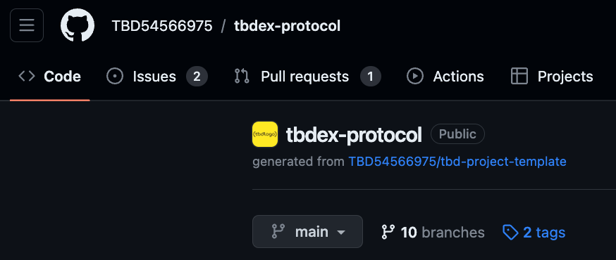
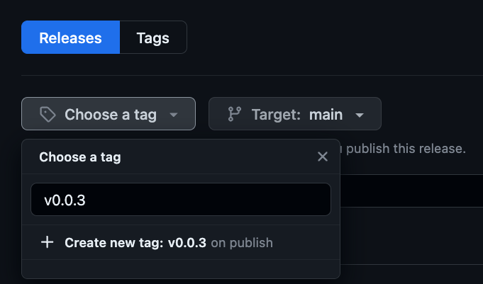
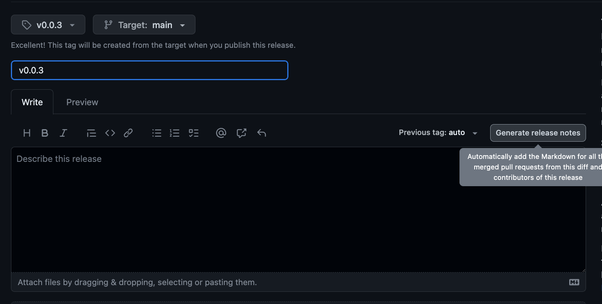

# tbDEX Protocol JS implementation <!-- omit in toc -->

This is a JS implementation of the tbDEX protocol (actually in typescript).

- [Installation](#installation)
- [Usage](#usage)
- [Development](#development)
  - [Prerequisites](#prerequisites)
    - [`node` and `npm`](#node-and-npm)
  - [Running Tests](#running-tests)
  - [`npm` scripts](#npm-scripts)
- [Publishing Releases](#publishing-releases)


# Installation

```bash
npm install @tbd54566975/tbdex
```

# Usage

Depending on your use case, you will be either building a client that interacts with the tbDEX protocol, or you will be building a server that implements the tbDEX protocol. The following sections will cover both use cases. Note while this is being built out that `tests` provide some reasonable examples to help get you started. `src/types` contain the typescript types if you are using typescript.

## Client

There is a convenience pfi-rest-api implementation you can use, as shown below.

### Getting exchange offerings
Using modular JS (both client and node): 

```mjs
// Import the required modules and classes using ESM
import { PfiRestClient } from "@tbd54566975/tbdex";

// Define the options for the getOfferings method
const offeringsOptions = {
  pfiDid: 'did:example:123456789abcdefghi',
};

// Call the getOfferings method
PfiRestClient.getOfferings(offeringsOptions).then(response => {
  if (response.status === 200) {
    console.log('Offerings:', response.data);
  } else {
    console.error('Error fetching offerings:', response.errors);
  }
}).catch(error => {
  console.error('Failed to fetch offerings:', error.message);
});
```

This will connect to the participating financtial institution (PFI) specified by its DID, and fetch the offerings (which will contain currency pairs, indicative rates and also requirements for identity verification).

NOTE: This is still a WIP and more convenience methods will be added shortly. 

### Getting Quotes

TODO

### Creating Orders

TODO

## Server

(TODO)


# Development

## Prerequisites
### `node` and `npm`
This project is using `node v20.3.0` and `npm v9.6.7`. You can verify your `node` and `npm` installation via the terminal:

```
$ node --version
v20.3.0
$ npm --version
9.6.7
```

If you don't have `node` installed. Feel free to choose whichever approach you feel the most comfortable with. If you don't have a preferred installation method, i'd recommend using `nvm` (aka node version manager). `nvm` allows you to install and use different versions of node. It can be installed by running `brew install nvm` (assuming that you have homebrew)

Once you have installed `nvm`, install the desired node version with `nvm install vX.Y.Z`.

## Running Tests
> [!NOTE]
> 
> Make sure you have all the [prerequisites](#prerequisites)

0. clone the repo and `cd` into the project directory
1. Install all project dependencies by running `npm install`
2. start the test databases using `./scripts/start-databases` (requires Docker)
3. run tests using `npm run test`

## `npm` scripts

| Script                 | Description                                               |
| ---------------------- | --------------------------------------------------------- |
| `npm run clean`        | deletes `dist` dir and compiled tests                     |
| `npm run test:node`    | runs tests in node runtime                                |
| `npm run test:browser` | runs tests in headless browsers (chrome, safari, firefox) |
| `npm run lint`         | runs linter without auto-fixing                           |
| `npm run lint:fix`     | runs linter and applies automatic fixes wherever possible |
| `npm run build`        | builds all distributions and dumps them into `dist`       |

# Publishing Releases

> [!NOTE]
>
> This section is applicable to core maintainers only

> [!IMPORTANT]
>
> be sure to version bump the package in `package.json` _before_ merging a PR

1. After merging the PR, navigate to Github's `tags` section of this repo [here](https://github.com/TBD54566975/tbdex-protocol/tags)


1. Click on `Releases` button and click `Draft a new release`.

2. Click on `Choose a tag`, then create a new tag with the version number matching from step 3. The release title is also the same version number, i.e. `v0.0.3`


1. Click `Generate release notes`. This will auto-populate a list of all PRs merged to main since the last release.


1. Click `Publish release`, which will kick off the `Release to NPM Registry` action, which you can see [here](https://github.com/TBD54566975/tbdex-protocol/actions/workflows/release-npm.yml)

2.  After the github action is successfully completed, you will have a new version of `@tbd54566975/tbdex` available in the [NPM registry](https://www.npmjs.com/package/@tbd54566975/tbdex).