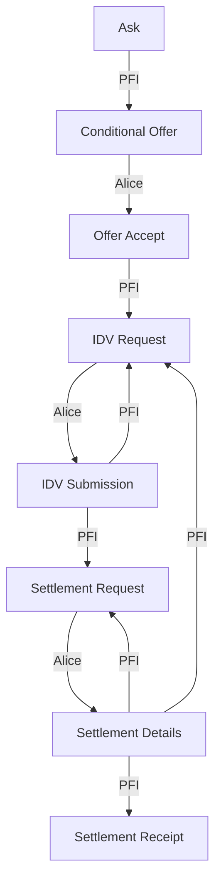

# tbDEX Protocol

- [tbDEX Protocol](#tbdex-protocol)
  - [Message Format & Structure](#message-format--structure)
  - [Message Types](#message-types)
    - [`Ask`](#ask)
    - [`ConditionalOffer`](#conditionaloffer)
    - [`OfferAccept`](#offeraccept)
    - [`IDVRequest`](#idvrequest)
    - [`IDVSubmission`](#idvsubmission)
    - [`SettlementRequest`](#settlementrequest)
    - [`SettlementDetails`](#settlementdetails)
    - [`SettlementReceipt`](#settlementreceipt)
    - [`Close`](#close)
  - [State Machine Diagram](#state-machine-diagram)
  - [Getting Started](#getting-started)
  - [Contributing](#contributing)
  - [Project Resources](#project-resources)

## Message Format & Structure
The structure of all tbDEX messages is modeled after [JSON Web Message (JWM)](https://tools.ietf.org/id/draft-looker-jwm-01.html). The reasons for choosing JWM are:
- JWM's encoding caters to virtually any transport protocol
- Reputability can be achieved using [JSON Web Signature (JWS)](https://datatracker.ietf.org/doc/html/rfc7515)
- Integrity protection and confidentiality can be achieved using [JSON Web Encryption (JWE)](https://datatracker.ietf.org/doc/html/rfc7516)


Every message contains the following fields:
| Field         | Data Type     | Required (y/n) | Description                                                                                                                           |
| ------------- | ------------- | -------------- | ------------------------------------------------------------------------------------------------------------------------------------- |
| `id`          | ?             | Y              | The message ID                                                                                                                        |
| `threadID`    | ?             | Y              | The thread ID. Set by the first message in a thread. A message thread is defined an initial message and its associated replies.       |
| `from`        | `string`      | Y              | The sender's DID                                                                                                                      |
| `to`          | `string`      | Y              | The recipient's DID                                                                                                                   |
| `type`        | `string`      | Y              | The specific message type. Any of the message types documented under the [Message Types](#Message-Types) section are considered valid |
| `body`        | `JSON Object` | Y              | The actual message content. the fields within `body` must adhere to the fields expected for the given message type                    |
| `createdTime` | `long`        | Y              | The creation time of the message. Expressed as seconds since the Epoch                                                                |
| `expiresTime` | `long`        | N              | The time after which this message should be considered as experied. Expressed as seconds since the epcoh                              |
| `replyTo`     | `string`      | ?              | A fully qualified URI that a reply can be sent to                                                                                     |


## Message Types

The `body` of each message can be any of the following message types

### `Ask`
**Description**:
| field            | data type | required | description                                                                                          |
| ---------------- | --------- | -------- | ---------------------------------------------------------------------------------------------------- |
| `sourceCurrency` | string    | Y        | The currency that you currently hold                                                                 |
| `sourceAmount`   | int       | Y        | The amount that you currently hold. Amount **must** be in the smallest denomination of said currency |
| `targetCurrency` | int       | Y        | the currency that you want                                                                           |

### `ConditionalOffer`
**Description**:
| field | data type | required | description |
| ---------------- | --------- | -------- | ------------------------------------- |
| `sourceCurrency` | string    | Y        | The currency that the customer held   |
| `targetCurrency` | int       | Y        | The currency that the customer wanted |
| `targetAmount`   | int       | Y        | The amount you're willing to offer    |

### `OfferAccept`
**Description**:
| field | data type | required | description |
| ----- | --------- | -------- | ----------- |

### `IDVRequest`
**Description**:
| field | data type | required | description |
| ----- | --------- | -------- | ----------- |

### `IDVSubmission`
**Description**:
| field | data type | required | description |
| ----- | --------- | -------- | ----------- |

### `SettlementRequest`
**Description**:
| field | data type | required | description |
| -------- | --------- | -------- | ------------------------------------------------------------------- |
| `schema` | string    | Y        | The json schema that defines what fields are required for payment   |

### `SettlementDetails`
**Description**:
| field | data type | required | description |
| ------ | --------- | -------- | ------------------------------------------------ |
| `body` | string    | Y        | The json schema from SettlementRequest filled in |

### `SettlementReceipt`
**Description**:
| field | data type | required | description |
| ----- | --------- | -------- | ----------- |

### `Close`
**Description**:
| field    | data type | required | description        |
| -------- | --------- | -------- | ------------------ |
| `reason` | string    | ?        | Reason for closing |

## State Machine Diagram
A sequence of associated messages is defined as a message thread. This diagram illustrates all possible state sequences for a message thread.
Each vertex represents a message type. Each edge represents who can transition the state of a message thread to the next vertex.

For example, starting from the top: "A PFI can reply to an `Ask` with a `ConditionalOffer`"

_Note: Assume that any vertex can transition to a `Close` by either participant_



## Getting Started
This library contains a number of classes and interfaces that you can use to simulate an end-to-end interaction between Alice and a PFI. Here's a rundown of the classes you can use
- **`Message`**
    - Class used to instantiate messages
- **`MessageProcessor`**
    - An interface you can implement to house the logic for processing a single `MessageType`
- **`MessageThreadProcessor`**
    - Class that ties everything together. On instantiation, you can register `MessageProcessor` instances to specific `MessageType`s. Adding a message to an instance of `MessageThreadProcessor` will execute the processor associated to the message's type.
- **`MessageThreadStore`**
  - An interface you can implement to store and retrieve messages. We've provided a default in-memory implementation named `InMemoryMessageThreadStore`. 

```java
package io.tbd.tbdex.protocol;

import io.tbd.tbdex.protocol.core.Message;
import io.tbd.tbdex.protocol.core.MessageThreadProcessor;
import io.tbd.tbdex.protocol.core.MessageType;
import io.tbd.tbdex.protocol.processors.AskProcessor;
import io.tbd.tbdex.protocol.processors.OfferAcceptProcessor;
import io.tbd.tbdex.protocol.messages.Ask;

import java.time.Instant;

public class Main {
  public static void main(String[] args) {
    InMemoryMessageThreadStore messageThreadStore = new InMemoryMessageThreadStore();
    MessageThreadProcessor pfi =
            new MessageThreadProcessor.Builder(messageThreadStore)
                .registerProcessor(MessageType.Ask, new AskProcessor())
                .registerProcessor(MessageType.OfferAccept, new OfferAcceptProcessor())
                .build();

    Ask ask = new Ask("USD", 100, "USDC");

    Message message =
            new Message.Builder("id", "threadID", "from", "to")
                    .createdTime(Instant.now())
                    .build(ask);

    Message reply = pfi.addMessage(message);
    System.out.println(reply);
  }
}
```

## Contributing
**TODO**: Fill out

## Project Resources

| Resource                                   | Description                                                                   |
| ------------------------------------------ | ----------------------------------------------------------------------------- |
| [CODEOWNERS](../CODEOWNERS)                 | Outlines the project lead(s)                                                  |
| [CODE_OF_CONDUCT.md](../CODE_OF_CONDUCT.md) | Expected behavior for project contributors, promoting a welcoming environment |
| [CONTRIBUTING.md](./CONTRIBUTING.md)       | Developer guide to build, test, run, access CI, chat, discuss, file issues    |
| [GOVERNANCE.md](../GOVERNANCE.md)           | Project governance                                                            |
| [LICENSE](../LICENSE)                       | Apache License, Version 2.0                                                   |
