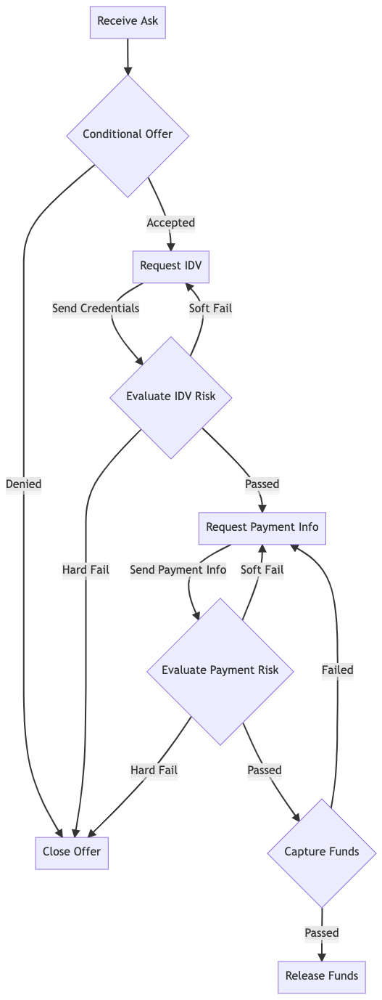

# PFI Mock Implementation

## Introduction
This is a mock implementation of a PFI (Participating Financial Institution) for the tbDex protocol. It is leveraging Circle's APIs in order to facilitate the on and off ramps.

The state machine from the perspective of the PFI:

- Supports USD -> USDC on-ramp
- Supports USDC -> USD off-ramp
- Stores messages in MySQL

## Contributing
TODO: Fill out

### Pre-requisites
- Java 15
- Docker

This repository contains a `docker-compose.yml` which defines all of the services that this implementation depends on (e.g. mysql). Running this application or integration tests requires that these services are running. Starting all of the necessary docker containers can be done by running `make dev-up`. When you're done, simply run `make dev-down`

### Running Tests
`make test`
