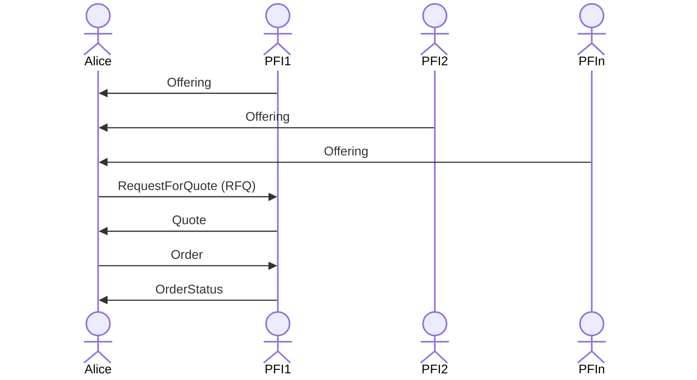

# tbDEX Protocol 

Currently non normative.

# Message Structure

This is a high level description of the message structure. In certainl implementations, some fields may be ommitted as they are part of some external envelope when transmitting on the wire as a message payload (for example - `threadID` is part of a DWN message (aka `contextId`), or DIDComm message, or could be a HTTP header). 

In any case, PFIs implementing this protocol should consider the fields below.

Every TBDex message contains the following fields:

| Field         | Data Type     | Required (y/n) | Description                                                                                                                           |
| ------------- | ------------- | -------------- | ------------------------------------------------------------------------------------------------------------------------------------- |
| `id`          | `string`      | Y              | The message ID                                                                                                                        |
| `contextId`    | `string`      | Y              | The context ID. Set by the first message in a thread. A message thread is defined an initial message and its associated replies.       |
| `from`        | `string`      | Y              | The sender's DID                                                                                                                      |
| `to`          | `string`      | Y              | The recipient's DID                                                                                                                   |
| `type`        | `string`      | Y              | The specific message type. Any of the message types documented under the [Message Types](#message-types) section are considered valid |
| `body`        | `JSON Object` | Y              | The actual message content. the fields within `body` must adhere to the fields expected for the given message type                    |
| `createdTime` | `long`        | Y              | The creation time of the message. Expressed as seconds since the Epoch                                                                |
| `expiresTime` | `long`        | N              | The time after which this message should be considered as expired. Expressed as seconds since the Epoch                               |

# Message Types

The `body` of each message can be any of the following message types

## `Offering`
| field            | data type | required | description                                                                                          |
| ---------------- | --------- | -------- | ---------------------------------------------------------------------------------------------------- |
| `id` | string    | Y        | A unique identifier for this offering.|
| `pair` | string    | Y        | The currency pair being offered, in the format of `basecurrency_countercurrency`.|
| `unitPrice` | string    | Y        | Price of 1 unit of base currency denominated in counter currency.|
| `baseFee`   | string       | N        | Optional base fee associated with this offering, regardless of which Payment Instruments are used |
| `min`   | string       | Y        | Minimum amount of counter currency that the counterparty (Alice) must submit in order to qualify for this offering.|
| `max`   | string       | Y        | Maximum amount of counter currency that the counterparty (Alice) can submit in order to qualify for this offering.|
| `presentationRequest`   | PresentationRequest    | Y        |  PresentationRequest which describes the credential needed to choose this offer.|
| `payinInstruments`   | list[PaymentInstrument]    | Y        |  A list of payment instruments the counterparty (Alice) can choose to send payment to the PFI from in order to qualify for this offering.|
| `payoutInstruments`   | list[PaymentInstrument]    | Y        |  A list of payment instruments the counterparty (Alice) can choose to receive payment from the PFI in order to qualify for this offering.|

### Note on base and counter currency in `pair`
There's an explicit directionality baked into the `pair` naming convention, which is `BaseCurrency_CounterCurrency`. Base Currency is the currency that the PFI is selling. Counter Currency is the currency that the PFI is willing to accept to sell the base currency (in other words, PFI is buying the Counter Currency). In trading terms, the side is always "SELL". 

### `PaymentInstrument`
| field            | data type | required | description                                                                                          |
| ---------------- | --------- | -------- | ---------------------------------------------------------------------------------------------------- |
| `kind` | enum    | Y        | Type of payment instrument (i.e. `DEBIT_CARD`, `BITCOIN_ADDRESS`)|
| `fee` | object    | N        | Optional fee associated with using this kind of payment instrument.|

PFI -> Alice: "Here's what I can offer if you want to buy BTC with USD, and here are the constraints of my offer, in terms of how much you can buy, what credentials I need from you, and what payment instruments you can use to pay me, and what payment instruments I can use to pay you."
```json
{
  "pair": "BTC_USD",
  "unitPrice": 27000.00,
  "baseFee": 1.00,
  "min": 10.00,
  "max": 100.00,
  "presentationRequest": { /* Presentation Request for KYC VC */ },
  "payinInstruments": [{
      "kind": "DEBIT_CARD",
      "fee": {
        "flatFee": 1.00
      }
  }],
  "payoutInstruments": [{
      "kind": "BTC_ADDRESS"
  }]
}
```
## `RequestForQuote`

| field            | data type | required | description                                                                                          |
| ---------------- | --------- | -------- | ---------------------------------------------------------------------------------------------------- |
| `rfqId` | string    | Y        | A unique identifier for this Request for Quote. |
| `pair` | string    | Y        | The currency pair being offered, in the format of `basecurrency_countercurrency`.|
| `amount` | string    | Y        | Amount of counter currency you want to spend in order to receive base currency|
| `verifiablePresentation` | VerifiablePresentation    | Y        | VerifiablePresentation that meets the specification per PresentationRequest in the Offering |
| `payinInstrument`   | PaymentInstrument       | Y        | Specify which payment instrument to send counter currency. |
| `payoutInstrument`   | PaymentInstrument       | Y        | Specify which payment instrument to receive base currency. |

Alice -> PFI: "OK, that offering looks good. I want a Quote against that Offering, and here is how much counter currency I want to trade for your base currency. Here's the payment instrument I intend to pay you with, and here's the payment instrument I expect you to pay me in."

```json
{
  "rfqId": "1",
  "pair": "BTC_USD",
  "amount": 10.00,
  "verifiablePresentation": { /* Alice's KYC VC in Verifiable Presentation format */ },
  "payinInstrument": {
      "kind": "DEBIT_CARD"
  },
  "payoutInstrument": {
      "kind": "BTC_ADDRESS"
  }
}
```

## `Quote`
| field            | data type   | required | description                                                   |
| ---------------- | ----------- | -------- | ------------------------------------------------------------- |
| `rfqId`          | string         | Y        | The identifier of the RFQ request this quote is responding to.|
| `quoteId`          | string         | Y        | The identifier of this quote.|
| `expiryTime`     | datetime         | Y        | When this quote expires.|
| `totalFee`     | string         | Y        | Total fee (base + paymentInstrument specific) included in quote|
| `amount`     | string         | Y        | Amount of base currency that the PFI is willing to send|
| `paymentPresentationRequest`     | PresentationRequest   | Y        | PresentationRequest that describes the payment instrument needed to execute this Quote (with payment kind indicated per the RFQ) |

PFI -> Alice: "OK, here's your Quote that describes how much base currency you will receive based on your RFQ. Here's the total fee associated with the payment instruments you selected, and here is the presentationRequest you can use to send in your payment instruments in, when you're ready to execute the Quote."
```json
{
  "rfqId": "1",
  "quoteId": "2",
  "expiryTime": "2023-04-14T12:12:12Z",
  "totalFee": 1.00,
  "amount": 0.000383,
  "paymentPresentationRequest": { /* Payin and payout instrument presentation requests in one */ }
}

```

## `Order`

| field             | data type   | required | description                                                                             |
| ----------------- | ----------- | -------- | --------------------------------------------------------------------------------------- |
| `orderId`   | string | Y        | A unique identifier for the Order being submitted |
| `quoteId` | string      | Y        | Identifier referencing the Quote to create the Order|
| `paymentVerifiablePresentation` | VerifiablePresentation      | Y        | VerifiablePresentation that meets the specification per paymentPresentationRequest in the Quote. |

Alice -> PFI: "Let's execute the Quote and turn it into an Order. Here are my payment instruments in the form of verifiable presentation, built against the paymentPresentationRequest in the Quote."
```json
{
    "orderId": 32432,
    "quoteId": 2,
    "paymentVerifiablePresentation": { /* Alice's Debit Card and Bitcoin VC in Verifiable Presentation format  */}
}
```

## `OrderStatus`

| field             | data type   | required | description                                                                             |
| ----------------- | ----------- | -------- | --------------------------------------------------------------------------------------- |
| `orderId`   | string | Y        | A unique identifier for the Order that was submitted |
| `orderStatus` | enum      | Y        | Current status of Order that's being executed |

PFI -> Alice: "Here's the status of your order."
```json
{
    "orderId": 32432,
    "orderStatus": "PENDING"
}
```

# Sequence Diagram




| Resource                                                                                         | Description                                                                   |
| ------------------------------------------------------------------------------------------------ | ----------------------------------------------------------------------------- |
| [CODEOWNERS](https://github.com/TBD54566975/tbdex-protocol/blob/main/CODEOWNERS)                 | Outlines the project lead(s)                                                  |
| [CODE_OF_CONDUCT.md](https://github.com/TBD54566975/tbdex-protocol/blob/main/CODE_OF_CONDUCT.md) | Expected behavior for project contributors, promoting a welcoming environment |
| [CONTRIBUTING.md](https://github.com/TBD54566975/tbdex-protocol/blob/main/CONTRIBUTING.md)       | Developer guide to build, test, run, access CI, chat, discuss, file issues    |
| [GOVERNANCE.md](https://github.com/TBD54566975/tbdex-protocol/blob/main/GOVERNANCE.md)           | Project governance                                                            |
| [LICENSE](https://github.com/TBD54566975/tbdex-protocol/blob/main/LICENSE)                       | Apache License, Version 2.0                                                   |
