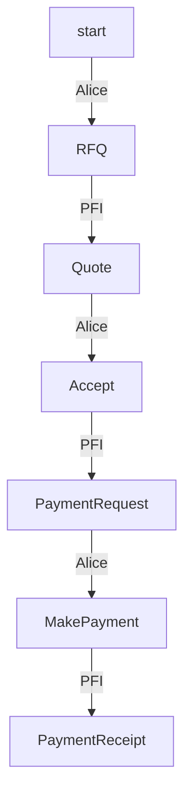
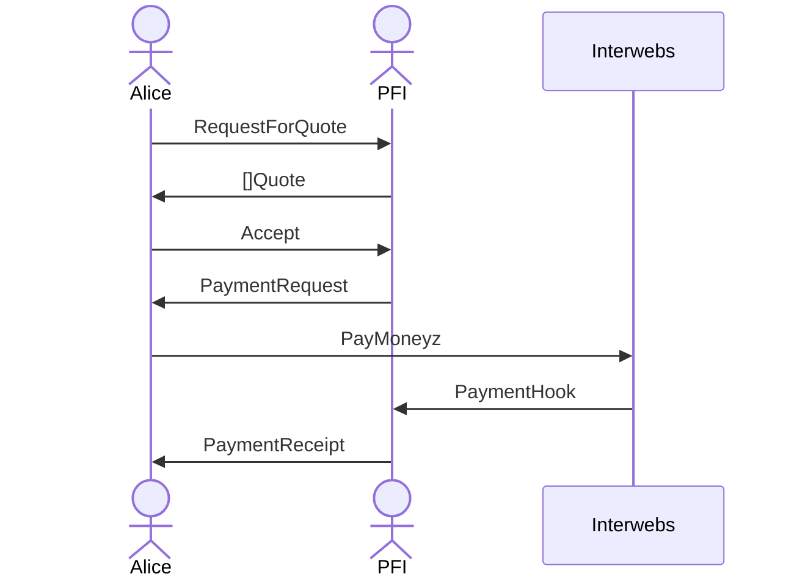

# tbDEX Protocol 

Currently non normative.

# Message Structure

This is a high level description of the message structure. In certainl implementations, some fields may be ommitted as they are part of some external envelope when transmitting on the wire as a message payload (for example - `threadID` is part of a DWN message (aka `contextId`), or DIDComm message, or could be a HTTP header). 

In any case, PFIs implementing this protocol should consider the fields below.

Every TBDex message contains the following fields:

| Field         | Data Type     | Required (y/n) | Description                                                                                                                           |
| ------------- | ------------- | -------------- | ------------------------------------------------------------------------------------------------------------------------------------- |
| `id`          | `string`      | Y              | The message ID                                                                                                                        |
| `contextId`    | `string`      | Y              | The context ID. Set by the first message in a thread. A message thread is defined an initial message and its associated replies.       |
| `from`        | `string`      | Y              | The sender's DID                                                                                                                      |
| `to`          | `string`      | Y              | The recipient's DID                                                                                                                   |
| `type`        | `string`      | Y              | The specific message type. Any of the message types documented under the [Message Types](#message-types) section are considered valid |
| `body`        | `JSON Object` | Y              | The actual message content. the fields within `body` must adhere to the fields expected for the given message type                    |
| `createdTime` | `long`        | Y              | The creation time of the message. Expressed as seconds since the Epoch                                                                |
| `expiresTime` | `long`        | N              | The time after which this message should be considered as expired. Expressed as seconds since the Epoch                               |

# Message Types

The `body` of each message can be any of the following message types

## `RequestForQuote`

| field            | data type | required | description                                                                                          |
| ---------------- | --------- | -------- | ---------------------------------------------------------------------------------------------------- |
| `id` | string    | Y        | A unique identifier for this request.                                                                 |
| `have` | string    | Y        | What you have.                                                                 |
| `want` | string    | Y        | What you want.                                                                           |
| `side`   | enum       | Y        | One of ["have", "want"] |
| `size`   | int       | Y        | When side is "want", amount of want to spend on order. When "have", amount of have to spend on order.  |
| `size`   | int       | Y        | When side is "want", amount of want to spend on order. When "have", amount of have to spend on order.  |
| `paymentTypes`   | JSON Object    | N        |  A normalized object describing the type of payments you need quotes for. When absent, the PFI is free to include any payment types.                 |

```json
{
  "id" : "1234",
  "have": "AUD",
  "want": "Cheese",
  "side": "have",
  "size": 100
}
```
I have 100 AUD, and I want Cheese

```json
{
  "id": "1234",
  "have": "AUD",
  "want": "Cheese",
  "side": "want",
  "size": 100
}
```
I have AUD, and I want 100 Cheese.


## Array of `Quote`
| field            | data type   | required | description                                                   |
| ---------------- | ----------- | -------- | ------------------------------------------------------------- |
| `quoteId`        | string         | Y        | Identifier for this quote.                                 |
| `requestForQuoteId`          | string         | Y        | The request this quote is responding to.                   |
| `offerUnit`     | string            | Y        | What I'm offering.                                         |
| `offerSize`     | int         | Y        | Amount that's being offered.                                         |
| `costUnit`      | string         | Y        | What is being requested in exchange for this offer.                            |
| `costSize`      | int            | Y        | Amount of `costUnit` that is being requested for this offer.                            |
| `paymentType`   | JSON Object    | Y        | A normalized object describing the type of payment acceptable for this offer.                        |
| `presentationDefinitionRequest`     | JSON Object    | Y        | PresentationRequest that describes that credential requirements needed to accept this offer |

```json
{
  "quoteId": "5678",
  "requestForQuoteId": "1234",
  "offerSize": 100,
  "offerUnit": "Cheese",
  "costSize": 150,
  "costUnit": "AUD",  
  "paymentType": {
    "type": "creditCard"
  },
  "presentationDefinitionRequest": ""
}
```
I'm offering 100 Cheese, and it will cost 150 AUD. You can pay me using a credit card.

## `Accept`

| field             | data type   | required | description                                                                             |
| ----------------- | ----------- | -------- | --------------------------------------------------------------------------------------- |
| `credentialsSubmission`   | JSON Object | Y        | Verifiable Presentation that satifies `presentationDefinitionRequest` |
| `acceptedQuoteId` | string      | Y        | ID ofr the chosen quote                            |
| `deliveryInstructions` | JSON Object      | Y        | Standard instructions of what the PFI should do after receiving payment. It could be physical instructions or bank account details of where to settle the funds.                        |

```json
{
  "credentialsSubmission": {...},
  "acceptedQuoteId": "5678",
  "deliveryInstructions": "leave a doggy bag with cheese on address 1234"
}
```

## `PaymentRequest`

| field    | data type | required | description                                                       |
| -------- | --------- | -------- | ----------------------------------------------------------------- |
| `paymentInstructions` | JSON Object    | Y        | Standard instructions of how the user should pay the PFI. |


## `PaymentReceipt`

| field | data type | required | description |
| ----- | --------- | -------- | ----------- |
| `verifiableCredentialJwt` | string | Y | A VC that represents a receipt of payment in a JWT representation. |

## `Close`

| field    | data type | required | description        |
| -------- | --------- | -------- | ------------------ |
| `reason` | string    | ?        | Reason for closing |

# State Machine Diagram

A sequence of associated messages is defined as a message thread. This diagram illustrates all possible state sequences for a message thread.
Each vertex represents a message type. Each edge represents who can transition the state of a message thread to the next vertex.

For example, starting from the top: "A PFI can reply to an `RFQ` with a `Quote`"

_Note: Assume that any vertex can transition to a `Close` by either participant_



# Sequence Diagram



Some terminology was inspired by https://github.com/fxcm/FIXAPI

A sketch of the protocol flow done on a whiteboard in NYC: 


This also shows (above the horizontal line) a propsal for PFI discovery (to find where to send RFQs to).

| Resource                                                                                         | Description                                                                   |
| ------------------------------------------------------------------------------------------------ | ----------------------------------------------------------------------------- |
| [CODEOWNERS](https://github.com/TBD54566975/tbdex-protocol/blob/main/CODEOWNERS)                 | Outlines the project lead(s)                                                  |
| [CODE_OF_CONDUCT.md](https://github.com/TBD54566975/tbdex-protocol/blob/main/CODE_OF_CONDUCT.md) | Expected behavior for project contributors, promoting a welcoming environment |
| [CONTRIBUTING.md](https://github.com/TBD54566975/tbdex-protocol/blob/main/CONTRIBUTING.md)       | Developer guide to build, test, run, access CI, chat, discuss, file issues    |
| [GOVERNANCE.md](https://github.com/TBD54566975/tbdex-protocol/blob/main/GOVERNANCE.md)           | Project governance                                                            |
| [LICENSE](https://github.com/TBD54566975/tbdex-protocol/blob/main/LICENSE)                       | Apache License, Version 2.0                                                   |
