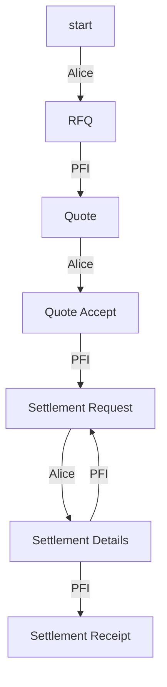

# tbDEX Protocol <!-- omit in toc -->

- [Message Structure](#message-structure)
- [Message Types](#message-types)
  - [`Request For Quote`](#quote)
  - [`Quote`](#quote)
  - [`QuoteAccept`](#quoteaccept)
  - [`SettlementRequest`](#settlementrequest)
  - [`SettlementDetails`](#settlementdetails)
  - [`SettlementReceipt`](#settlementreceipt)
  - [`Close`](#close)
- [State Machine Diagram](#state-machine-diagram)


# Message Structure

This is a high level description of the message structure. In certainl implementations, some fields may be ommitted as they are part of some external envelope when transmitting on the wire as a message payload (for example - `threadID` is part of a DWN message (aka `contextId`), or DIDComm message, or could be a HTTP header). 

In any case, PFIs implementing this protocol should consider the fields below.

Every TBDex message contains the following fields:

| Field         | Data Type     | Required (y/n) | Description                                                                                                                           |
| ------------- | ------------- | -------------- | ------------------------------------------------------------------------------------------------------------------------------------- |
| `id`          | `string`      | Y              | The message ID                                                                                                                        |
| `threadID`    | `string`      | Y              | The thread ID. Set by the first message in a thread. A message thread is defined an initial message and its associated replies.       |
| `from`        | `string`      | Y              | The sender's DID                                                                                                                      |
| `to`          | `string`      | Y              | The recipient's DID                                                                                                                   |
| `type`        | `string`      | Y              | The specific message type. Any of the message types documented under the [Message Types](#message-types) section are considered valid |
| `body`        | `JSON Object` | Y              | The actual message content. the fields within `body` must adhere to the fields expected for the given message type                    |
| `createdTime` | `long`        | Y              | The creation time of the message. Expressed as seconds since the Epoch                                                                |
| `expiresTime` | `long`        | N              | The time after which this message should be considered as expired. Expressed as seconds since the Epoch                               |

# Message Types

The `body` of each message can be any of the following message types

## `RequestForQuote`

| field            | data type | required | description                                                                                          |
| ---------------- | --------- | -------- | ---------------------------------------------------------------------------------------------------- |
| `sourceAsset` | string    | Y        | The currency that you currently hold                                                                 |
| `targetAsset` | string    | Y        | the currency that you want                                                                           |
| `quantity`   | int       | Y        | The amount that you currently want to convert.  |
| `denomination`   | string       | N        | sourceAsset or targetAsset |

```json
{
  "have": "AUD",
  "want": "Cheese",
  "haveQuantity": "1" 
}
```

```json
{
  "have": "AUD",
  "want": "USD",
  "wantQuantity": "100" 
}

```

I want 100 USD, and I have AUD.
Quote1: I can give you 100 USD for 150AUD
Quote2: I can give you 90 USD for 100AUD


I have 150 AUD, I want to convert it to USD
Quote1: I can give you 100 USD for 150AUD
Quote2: I can give you 90 USD for 99AUD


## `Quote` (multiple quotes can result from one RFQ)

| field            | data type   | required | description                                                   |
| ---------------- | ----------- | -------- | ------------------------------------------------------------- |
| `sourceAsset` | string      | Y        | The currency that the customer held                           |
| `targetAsset` | string      | Y        | The currency that the customer wanted                         |
| `targetAmount`   | int         | Y        | The amount you're willing to offer                            |
| `idvRequest`     | JSON Object | Y        | Identity requirements to satisfy this offer |

```json
{
  "have": "AUD",
  "want": "USD",
  "wantQuantity": "100", 
  "idvRequest: ""
}
```

## `QuoteAccept`

| field             | data type   | required | description                                                                             |
| ----------------- | ----------- | -------- | --------------------------------------------------------------------------------------- |
| `idvSubmission`   | JSON Object | Y        | Verifiable Presentation that satifies `idvRequest` |
| `acceptedBidHash` | string      | Y        | A hash of the chosen quote (source, target and amount).                                   |

## `SettlementRequest`

| field    | data type | required | description                                                       |
| -------- | --------- | -------- | ----------------------------------------------------------------- |
| `schema` | string    | Y        | The json schema that defines what fields are required for payment |


## `SettlementDetails`

| field  | data type | required | description                                      |
| ------ | --------- | -------- | ------------------------------------------------ |
| `body` | string    | Y        | The json schema from SettlementRequest filled in |

## `SettlementReceipt`

| field | data type | required | description |
| ----- | --------- | -------- | ----------- |

## `Close`

| field    | data type | required | description        |
| -------- | --------- | -------- | ------------------ |
| `reason` | string    | ?        | Reason for closing |

# State Machine Diagram

A sequence of associated messages is defined as a message thread. This diagram illustrates all possible state sequences for a message thread.
Each vertex represents a message type. Each edge represents who can transition the state of a message thread to the next vertex.

For example, starting from the top: "A PFI can reply to an `RFQ` with a `Quote`"

_Note: Assume that any vertex can transition to a `Close` by either participant_




| Resource                                                                                         | Description                                                                   |
| ------------------------------------------------------------------------------------------------ | ----------------------------------------------------------------------------- |
| [CODEOWNERS](https://github.com/TBD54566975/tbdex-protocol/blob/main/CODEOWNERS)                 | Outlines the project lead(s)                                                  |
| [CODE_OF_CONDUCT.md](https://github.com/TBD54566975/tbdex-protocol/blob/main/CODE_OF_CONDUCT.md) | Expected behavior for project contributors, promoting a welcoming environment |
| [CONTRIBUTING.md](https://github.com/TBD54566975/tbdex-protocol/blob/main/CONTRIBUTING.md)       | Developer guide to build, test, run, access CI, chat, discuss, file issues    |
| [GOVERNANCE.md](https://github.com/TBD54566975/tbdex-protocol/blob/main/GOVERNANCE.md)           | Project governance                                                            |
| [LICENSE](https://github.com/TBD54566975/tbdex-protocol/blob/main/LICENSE)                       | Apache License, Version 2.0                                                   |
