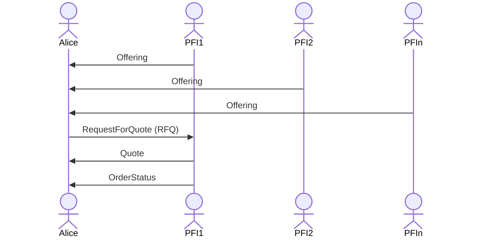

# tbDEX Protocol 

Currently non normative.

# tbDEX Types
## Messages
Messages form exchanges between users and PFIs. 
## Resources
A tbDEX resource is not a tbDEX message. i.e. it does not follow the message structure, and therefore does not include fields like `to`, `threadId`, etc. A tbdex resource is published for anyone to read and generally used as a part of the discovery process by users.

# Resource Types

## `Offering`
> PFI -> world: "Here are the exchanges that my PFI offers. These are the constraints of my offer in terms of how much you can buy, what credentials I need from you, and what payment methods you can use to pay me the base currency, and what payment methods I can use to pay you the counter currency."

| field            | data type | required | description                                                                                          |
| ---------------- | --------- | -------- | ---------------------------------------------------------------------------------------------------- |
| `id` | string    | Y        | Unique identifier for this offering|
| `description` | string    | Y        | Brief description of what is being offered.|
| `pair` | string    | Y        | The currency pair being offered, in the format of `basecurrency_countercurrency`.|
| `unitPrice` | string    | Y        | Price of 1 unit of base currency denominated in counter currency.|
| `baseFee`   | string       | N        | Optional base fee associated with this offering, regardless of which payment methods are used |
| `min`   | string       | Y        | Minimum amount of counter currency that the counterparty (Alice) must submit in order to qualify for this offering.|
| `max`   | string       | Y        | Maximum amount of counter currency that the counterparty (Alice) can submit in order to qualify for this offering.|
| `kycPresentationRequestJwt`   | string    | Y        |  PresentationRequest in JWT string format which describes the credential needed to choose this offer.|
| `payinMethods`   | list[PaymentMethod]    | Y        |  A list of payment methods the counterparty (Alice) can choose to send payment to the PFI from in order to qualify for this offering.|
| `payoutMethods`   | list[PaymentMethod]    | Y        |  A list of payment methods the counterparty (Alice) can choose to receive payment from the PFI in order to qualify for this offering.|
| `createdTime` | datetime        | Y              | The creation time of the resource. Expressed as ISO8601|


### Note on base and counter currency in `pair`
There's an explicit directionality baked into the `pair` naming convention, which is `BaseCurrency_CounterCurrency`. Base Currency is the currency that the PFI is **selling**. Counter Currency is the currency that the PFI is willing to accept to sell the base currency (in other words, PFI is **buying** the Counter Currency). In trading terms, the PFI's side is always "SELL". 

### `PaymentMethod`
| field            | data type | required | description                                                                                          |
| ---------------- | --------- | -------- | ---------------------------------------------------------------------------------------------------- |
| `kind` | enum    | Y        | Type of payment method (i.e. `DEBIT_CARD`, `BITCOIN_ADDRESS`)|
| `paymentPresentationRequestJwt`     | string   | Y        | PresentationRequest that describes the VCs needed to use this PaymentMethod in JWT string format|
| `fee` | object    | N        | Optional fee associated with using this kind of payment method.|


```json
{
  "description": "Buy BTC with USD!",
  "pair": "BTC_USD",
  "unitPrice": 27000.00,
  "baseFee": 1.00,
  "min": 10.00,
  "max": 100.00,
  "presentationRequestJwt": "eyJhb...MIDw",
  "payinInstruments": [{
    "paymentPresentationRequestJwt": "eyJhb...MIDw",
    "kind": "DEBIT_CARD",
    "fee": {
      "flatFee": 1.00
    }
  },
  {
    "paymentPresentationRequestJwt": "xyz...12as",
    "kind": "CREDIT_CARD",
    "fee": {
      "flatFee": 4.00
    }
  }],
  "payoutInstruments": [{
    "paymentPresentationRequestJwt": "abc...IDsx",
    "kind": "BTC_ADDRESS"
  }],
  "createdTime": "2023-06-23T11:23:41Z"
}
```

# Message Structure

This is a high level description of the message structure. In certain implementations, some fields may be omitted as they are part of some external envelope when transmitting on the wire as a message payload (for example - `record.threadID` is part of a DWN message, or DIDComm message, or could be a HTTP header). 

In any case, PFIs implementing this protocol should consider the fields below.

Every TBDex message contains the following fields:

| Field         | Data Type     | Required (y/n) | Description                                                                                                                           |
| ------------- | ------------- | -------------- | ------------------------------------------------------------------------------------------------------------------------------------- |
| `id`          | string      | Y              | The message ID                                                                                                                        |
| `threadId`    | string      | Y              | The thread ID. Set by the first message in a conversation. A message thread is defined an initial message and its associated replies. |
| `parentId`    | string      | Y              | The ID of the last message in the thread.                                                                                             |
| `from`        | string      | Y              | The sender's DID                                                                                                                      |
| `to`          | string      | Y              | The recipient's DID                                                                                                                   |
| `type`        | string      | Y              | The specific message type. Any of the message types documented under the [Message Types](#message-types) section are considered valid |
| `body`        | JSON Object | Y              | The actual message content. the fields within `body` must adhere to the fields expected for the given message type                    |
| `createdTime` | datetime    | Y              | The creation time of the message. Expressed as ISO8601|


# ID for each message types
The top-level TBDex `id` will serve as each message type's unique identifier. The message type is indicated with `type` field (i.e. `Quote`, `RFQ`, etc). `threadId` will serve as a way to identify a "thread" of messages sent back and forth between Alice and PFI.

# Message Types
The `body` of each message can be any of the following message types.

## `RequestForQuote (RFQ for short)`
> Alice -> PFI: "OK, that offering looks good. I want a Quote against that Offering, and here is how much USD I want to trade for BTC. Here's the payment method I intend to pay you USD with, and here's the payment method I expect you to pay me BTC in."

| field            | data type | required | description                                                                                          |
| ---------------- | --------- | -------- | ---------------------------------------------------------------------------------------------------- |
| `pair` | string    | Y        | The currency pair being offered, in the format of `basecurrency_countercurrency`.|
| `amount` | string    | Y        | Amount of counter currency you want to spend in order to receive base currency|
| `kycVerifiablePresentationJwt` | string    | Y        | VerifiablePresentation that meets the specification per PresentationRequest in the Offering, in JWT string format |
| `payinMethod`   | PaymentMethodResponse       | Y        | Specify which payment method to send counter currency. |
| `payoutMethod`   | PaymentMethodResponse       | Y        | Specify which payment method to receive base currency. |

### `PaymentMethodResponse`
| field            | data type | required | description                                                                                          |
| ---------------- | --------- | -------- | ---------------------------------------------------------------------------------------------------- |
| `kind` | enum    | Y        | Type of payment method (i.e. `DEBIT_CARD`, `BITCOIN_ADDRESS`)|
| `paymentVerifiablePresentationJwt`     | string   | Y        | VerifiablePresentation that meets the specification per paymentPresentationRequest in the Offering, in JWT string format.|

```json
{
  "pair": "BTC_USD",
  "amount": 10.00,
  "kycVerifiablePresentationJwt": "",
  "payinInstrument": {
    "kind": "DEBIT_CARD",
    "paymentVerifiablePresentationJwt": ""
  },
  "payoutInstrument": {
    "kind": "BTC_ADDRESS",
    "paymentVerifiablePresentationJwt": ""
  }
}
```

## `Quote`
> PFI -> Alice: "OK, here's your Quote that describes how much BTC you will receive based on your RFQ. Here's the total fee in USD associated with the payment methods you selected. Here's how to pay us, and how to let us pay you, when you're ready to execute the Quote. This quote expires at X time."

| field            | data type   | required | description                                                   |
| ---------------- | ----------- | -------- | ------------------------------------------------------------- |
| `expiryTime`     | datetime         | Y        | When this quote expires. Expressed as ISO8601|
| `totalFee`     | string         | Y        | Total fee (base + PaymentMethod specific) included in quote in counter currency.|
| `amount`     | string         | Y        | Amount of base currency that the PFI is willing to sell in exchange for counter currency `amount` in the original RFQ|
| `paymentInstructions`     | PaymentInstructions   | Y        | Object that describes how to pay the PFI, and how to get paid by the PFI, in the instances where payment must be performed "out-of-band" (e.g. PFI cannot be both a merchant and a payment processor simultaneously) |

### `PaymentInstructions`
| field            | data type | required | description                                                                                          |
| ---------------- | --------- | -------- | ---------------------------------------------------------------------------------------------------- |
| `payin` | PaymentInstruction    | N        | Link or Instruction describing how to pay the PFI. |
| `payout` | PaymentInstruction    | N        | Link or Instruction describing how to get paid by the PFI|

### `PaymentInstruction`
| field            | data type | required | description                                                                                          |
| ---------------- | --------- | -------- | ---------------------------------------------------------------------------------------------------- |
| `link` | String    | N        | Link to allow Alice to pay PFI, or be paid by the PFI |
| `instruction` | String    | N        | Instruction on how Alice can pay PFI, or how Alice can be paid by the PFI|


```json
{
  "expiryTime": "2023-04-14T12:12:12Z",
  "totalFee": 2.00,
  "amount": 0.000383,
  "paymentInstructions": {
    "payin": {
      "link": "stripe.com/xyz"
    }
  }
}
```

## `OrderStatus`
> PFI -> Alice: "Here's the status of your order."

| field             | data type   | required | description                                                                             |
| ----------------- | ----------- | -------- | --------------------------------------------------------------------------------------- |
| `orderStatus` | enum      | Y        | Current status of Order that's being executed |

```json
{
  "orderStatus": "PENDING"
}
```

## Fields that may change in future versions of the schema
- `pair` in `Offering` object: there's a discussion on whether to stick to this pair convention, or to split it out to 2 fields - base and counter currency.
- `fee` in `Offering` object: the way PFIs assess fees for a given offering, as well as for specific payment methods will become more complex over time. Currently, there's only 1 field in the fee object, `flatFee`.
- `expiryTime` in `Offering` object: this field will likely be added in future versions to ensure that PFIs can advertise the most up-to-date offerings, and to ensure that Quote price is not a vast departure from the corresponding Offering.
- `paymentInstructions` in `Quote` object: this object is currently in place to ensure that a PFI that cannot accept raw payinInstrument object as a VC (i.e. plaintext values) for PCI compliance reasons, and therefore need to use a 3rd party payment processor to execute payment "out-of-band". There's still more thoughts that need to form around whether this is a good long-term solution, or if something like Proof of Payment VC issued by Payment Processor, or use of a smart contract would be more appropriate.
- `min/max` at the top level of `Offering` or specific to each `payin/outInstrument`: it's possible that we may want to specify `min/max` amount depending on each payment method


# tbDEX conversation sequence




| Resource                                                                                         | Description                                                                   |
| ------------------------------------------------------------------------------------------------ | ----------------------------------------------------------------------------- |
| [CODEOWNERS](https://github.com/TBD54566975/tbdex-protocol/blob/main/CODEOWNERS)                 | Outlines the project lead(s)                                                  |
| [CODE_OF_CONDUCT.md](https://github.com/TBD54566975/tbdex-protocol/blob/main/CODE_OF_CONDUCT.md) | Expected behavior for project contributors, promoting a welcoming environment |
| [CONTRIBUTING.md](https://github.com/TBD54566975/tbdex-protocol/blob/main/CONTRIBUTING.md)       | Developer guide to build, test, run, access CI, chat, discuss, file issues    |
| [GOVERNANCE.md](https://github.com/TBD54566975/tbdex-protocol/blob/main/GOVERNANCE.md)           | Project governance                                                            |
| [LICENSE](https://github.com/TBD54566975/tbdex-protocol/blob/main/LICENSE)                       | Apache License, Version 2.0                                                   |