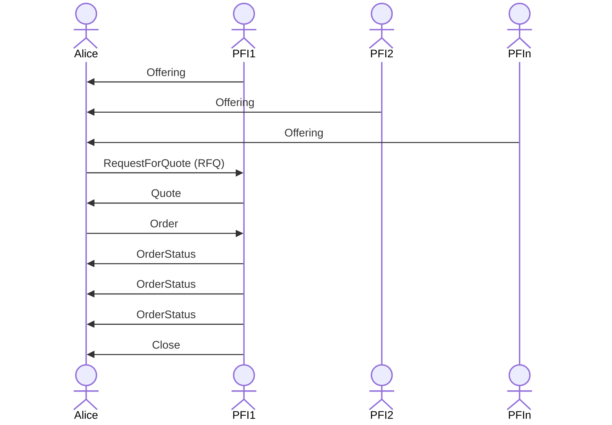

# tbDEX Protocol <!-- omit in toc -->

# Introduction <!-- omit in toc -->
tbDEX is a protocol for discovering liquidity and exchanging assets such as fiat money, real world goods, stablecoins or bitcoin. The tbDEX protocol utilizes [Decentralized Identitifers (DIDs)](https://www.w3.org/TR/did-core/) and [Verifiable Credentials (VCs)](https://www.w3.org/TR/vc-data-model/) to establish the provenance of identity in the real world. The protocol has no opinion on anonymity as a feature or consequence of transactions. Instead, it allows willing counterparties to negotiate and establish the minimum information acceptable for an exchange.

This specification defines the message and resource formats that make up the tbDEX messaging protocol which is composed of two key concepts: [_Resources_](#resources) and [_Messages_](#messages).

# Status <!-- omit in toc -->
Version: Draft

> [!NOTE]
> 
> This specification will continue to be in a **Draft** state until there are two separate PFIs deployed and providing liquidity to individuals or other institutions


# Table of Contents <!-- omit in toc -->
- [Resources](#resources)
  - [Fields](#fields)
    - [`metadata`](#metadata)
    - [`data`](#data)
    - [`signature`](#signature)
  - [Resource Kinds](#resource-kinds)
    - [`Offering`](#offering)
      - [`PayinDetails`](#payindetails)
      - [`PayoutDetails`](#payoutdetails)
      - [`PayinMethod`](#payinmethod)
      - [`PayoutMethod`](#payoutmethod)
        - [Reserved `PaymentMethod` Kinds](#reserved-paymentmethod-kinds)
      - [Example Offering](#example-offering)
    - [`Balance`](#balance)
      - [Example Balance](#example-balance)
    - [`Reputation`](#reputation)
- [Messages](#messages)
  - [Fields](#fields-1)
    - [`metadata`](#metadata-1)
    - [`data`](#data-1)
    - [`privateData`](#privatedata)
      - [Example Usage in RFQ message](#example-usage-in-rfq-message)
    - [`signature`](#signature-1)
  - [ID generation](#id-generation)
  - [Digest](#digest)
  - [`DecimalString`](#decimalstring)
  - [Message Kinds](#message-kinds)
    - [`RFQ (Request For Quote)`](#rfq-request-for-quote)
      - [`SelectedPayinMethod`](#selectedpayinmethod)
      - [`SelectedPayoutMethod`](#selectedpayoutmethod)
      - [`privateData`](#privatedata-1)
      - [`PrivatePaymentDetails`](#privatepaymentdetails)
      - [RFQ example](#rfq-example)
    - [`Close`](#close)
      - [Example Close](#example-close)
    - [`Quote`](#quote)
      - [`QuoteDetails`](#quotedetails)
      - [`PaymentInstruction`](#paymentinstruction)
      - [Example Quote](#example-quote)
    - [`Order`](#order)
      - [Example Order](#example-order)
    - [`OrderStatus`](#orderstatus)
- [Common Traits](#common-traits)
  - [ID Generation](#id-generation-1)
  - [Digests](#digests)
    - [Rationale](#rationale)
      - [Why JSON Canonicalization Scheme (JCS)?](#why-json-canonicalization-scheme-jcs)
      - [Why SHA256?](#why-sha256)
      - [Why Base64url?](#why-base64url)
  - [Signatures](#signatures)
- [tbDEX conversation sequence](#tbdex-conversation-sequence)
- [Jargon Decoder](#jargon-decoder)
- [Stored Balances](#stored-balances)
  - [Top up stored balance](#top-up-stored-balance)
  - [Off ramp using stored balance](#off-ramp-using-stored-balance)
- [Additional Resources](#additional-resources)

# Resources
tbDEX Resources are published by PFIs and generally used as a part of the discovery process. They are not part of the message exchange, i.e Alice cannot reply to a Resource.

There exist both publicly available and protected resources. Publicly available ones can be listed by any caller without authorization. Protected resources may only be accessible to specific DIDs. 

## Fields
All tbdex resources are JSON objects which can include the following top-level properties:

| Field       | Required (Y/N) | Description                                                            |
| ----------- | -------------- | ---------------------------------------------------------------------- |
| `metadata`  | Y              | An object containing fields _about_ the resource                       |
| `data`      | Y              | The actual resource content (e.g. an offering)                         |
| `signature` | Y              | signature that verifies the authenticity and integrity of the resource |

### `metadata`
The `metadata` object contains fields _about_ the resource and is present in _every_ tbdex resource. 


| Field       | Required (Y/N) | Description                                                                                                                                                                                                                                                 |
| ----------- | -------------- | ----------------------------------------------------------------------------------------------------------------------------------------------------------------------------------------------------------------------------------------------------------- |
| `from`      | Y              | The authors's DID                                                                                                                                                                                                                                           |
| `kind`      | Y              | the `data` property's type. e.g. `offering`                                                                                                                                                                                                                 |
| `id`        | Y              | The resource's ID                                                                                                                                                                                                                                           |
| `createdAt` | Y              | ISO 8601 timestamp                                                                                                                                                                                                                                          |
| `updatedAt` | N              | ISO 8601 timestamp                                                                                                                                                                                                                                          |
| `protocol`  | Y              | Version of the protocol in use (x.x format). The protocol version must remain consistent across messages in a given exchange. Messages sharing the same `exchangeId` MUST also have the same `protocol` version. Protocol versions are tracked in this repo |


### `data`
The actual resource content. This will _always_ be a JSON object. The [Resource Kinds section](#resource-kinds) specifies the content for each individual resource type

### `signature`
see [here](#signatures) for more details

## Resource Kinds

### `Offering`
An `Offering` is a resource created by a PFI to define requirements for a given currency pair offered for exchange.

> PFI -> world: "Here are the currency pairs i have to offer. These are the constraints of my offer in terms of how much you can buy, what credentials I need from you, and what payment methods you can use to pay me the payin currency, and what payment methods I can use to pay you the payout currency."

| field                     | data type                                                                                                | required | description                                                                  |
| ------------------------- | -------------------------------------------------------------------------------------------------------- | -------- | ---------------------------------------------------------------------------- |
| `description`             | string                                                                                                   | Y        | Brief description of what is being offered.                                  |
| `payoutUnitsPerPayinUnit` | [`DecimalString`](#decimalstring)                                                                        | Y        | Number of payout units alice would get for 1 payin unit. An indicative rate. |
| `payin`                   | [`PayinDetails`](#payindetails)                                                                          | Y        | Details and options associated to the _payin_ currency                       |
| `payout`                  | [`PayoutDetails`](#payoutdetails)                                                                        | Y        | Details and options associated to the _payout_ currency                      |
| `requiredClaims`          | [`PresentationDefinitionV2`](https://identity.foundation/presentation-exchange/#presentation-definition) | N        | Claim(s) required when submitting an RFQ for this offering.                  |

#### `PayinDetails`
| field          | data type                         | required | description                                            |
| -------------- | --------------------------------- | -------- | ------------------------------------------------------ |
| `currencyCode` | string                            | Y        | ISO 4217 currency code string                          |
| `min`          | [`DecimalString`](#decimalstring) | N        | Minimum amount of currency that the offer is valid for |
| `max`          | [`DecimalString`](#decimalstring) | N        | Maximum amount of currency that the offer is valid for |
| `methods`      | [`PayinMethod[]`](#payinmethod)   | Y        | A list of payment methods to select from               |

#### `PayoutDetails`
| field          | data type                         | required | description                                            |
| -------------- | --------------------------------- | -------- | ------------------------------------------------------ |
| `currencyCode` | string                            | Y        | ISO 4217 currency code string                          |
| `min`          | [`DecimalString`](#decimalstring) | N        | Minimum amount of currency that the offer is valid for |
| `max`          | [`DecimalString`](#decimalstring) | N        | Maximum amount of currency that the offer is valid for |
| `methods`      | [`PayoutMethod[]`](#payoutmethod) | Y        | A list of payment methods to select from               |

#### `PayinMethod`
| field                    | data type                               | required | description                                                                                                                                         |
| ------------------------ | --------------------------------------- | -------- | --------------------------------------------------------------------------------------------------------------------------------------------------- |
| `kind`                   | string                                  | Y        | Unique string identifying a single kind of payment method i.e. (i.e. `DEBIT_CARD`, `BITCOIN_ADDRESS`, `SQUARE_PAY`)                                 |
| `name`                   | string                                  | N        | Payment Method name. Expected to be rendered on screen.                                                                                             |
| `description`            | string                                  | N        | Blurb containing helpful information about the payment method. Expected to be rendered on screen. e.g. "segwit addresses only"                      |
| `group`                  | string                                  | N        | The category for which the given method belongs to e.g. Mobile Money vs. Direct Bank Deposit                                                        |
| `requiredPaymentDetails` | [JSON Schema](https://json-schema.org/) | N        | A JSON Schema containing the fields that need to be collected in the RFQ's selected payment methods in order to use this payment method.            |
| `fee`                    | [`DecimalString`](#decimalstring)       | N        | Fee charged to use this payment method. absence of this field implies that there is no _additional_ fee associated to the respective payment method |
| `min`                    | [`DecimalString`](#decimalstring)       | N        | minimum amount required to use this payment method.                                                                                                 |
| `max`                    | [`DecimalString`](#decimalstring)       | N        | maximum amount allowed when using this payment method.                                                                                              |

> [!IMPORTANT]
> `kind` should be a unique identifier of an individual payment method

> [!IMPORTANT]
> the presence of `min` or `max` in a payment method takes precedence over `min` or `max` defined at the `PaymentDetails` level.

> [!IMPORTANT]
> If `requiredPaymentDetails` is omitted, then any RFQs submitted for the respective offering must also omit `paymentDetails`. 

#### `PayoutMethod`
| field                     | data type                               | required | description                                                                                                                                         |
| ------------------------- | --------------------------------------- | -------- | --------------------------------------------------------------------------------------------------------------------------------------------------- |
| `kind`                    | string                                  | Y        | Unique string identifying a single kind of payment method i.e. (i.e. `DEBIT_CARD`, `BITCOIN_ADDRESS`, `SQUARE_PAY`)                                 |
| `estimatedSettlementTime` | uint                                    | Y        | estimated time taken to settle an order. expressed in seconds                                                                                       |
| `name`                    | string                                  | N        | Payment Method name. Expected to be rendered on screen.                                                                                             |
| `description`             | string                                  | N        | Blurb containing helpful information about the payment method. Expected to be rendered on screen. e.g. "segwit addresses only"                      |
| `group`                   | string                                  | N        | The category for which the given method belongs to e.g. Mobile Money vs. Direct Bank Deposit                                                        |
| `requiredPaymentDetails`  | [JSON Schema](https://json-schema.org/) | N        | A JSON Schema containing the fields that need to be collected in the RFQ's selected payment methods in order to use this payment method.            |
| `fee`                     | [`DecimalString`](#decimalstring)       | N        | Fee charged to use this payment method. absence of this field implies that there is no _additional_ fee associated to the respective payment method |
| `min`                     | [`DecimalString`](#decimalstring)       | N        | minimum amount required to use this payment method.                                                                                                 |
| `max`                     | [`DecimalString`](#decimalstring)       | N        | maximum amount allowed when using this payment method.                                                                                              |


> [!IMPORTANT]
> `estimatedSettlementTime` is used to provide a rough estimate for the expected latency between receiving a _payin_ and settling the respective _payout_.
> In simpler terms: "how much time would you estimate between receiving my payin and the payout landing where I specified?"

##### Reserved `PaymentMethod` Kinds

Some payment methods should be consistent across PFIs and therefore have reserved `kind` values. PFIs may provide, as a feature, stored balances, which are effectively the PFI custodying assets or funds on behalf of their customer. Customers can top up this balance and their transactions can draw against this balance. 

| kind             | description                                                                                                    |
| ---------------- | -------------------------------------------------------------------------------------------------------------- |
| `STORED_BALANCE` | Represents a customer's balance with the PFI. See [Stored Balances](#stored-balances) for information on usage |

#### Example Offering
```json
{
  "metadata": {
    "from": "did:ex:pfi",
    "kind": "offering",
    "id": "offering_01ha82y8d0fhstg95hhfjwmgxf",
    "createdAt": "2023-09-13T20:15:22.528Z",
    "protocol": "1.0"
  },
  "data": {
    "description": "Selling BTC for USD",
    "payoutUnitsPerPayinUnit": "0.00003826",
    "payin": {
      "currencyCode": "USD",
      "methods": [
        {
          "kind": "DEBIT_CARD",
          "requiredPaymentDetails": {
            "$schema": "http://json-schema.org/draft-07/schema#",
            "type": "object",
            "properties": {
              "cardNumber": {
                "type": "string",
                "description": "The 16-digit debit card number",
                "minLength": 16,
                "maxLength": 16
              },
              "expiryDate": {
                "type": "string",
                "description": "The expiry date of the card in MM/YY format",
                "pattern": "^(0[1-9]|1[0-2])\\/([0-9]{2})$"
              },
              "cardHolderName": {
                "type": "string",
                "description": "Name of the cardholder as it appears on the card"
              },
              "cvv": {
                "type": "string",
                "description": "The 3-digit CVV code",
                "minLength": 3,
                "maxLength": 3
              }
            },
            "required": [
              "cardNumber",
              "expiryDate",
              "cardHolderName",
              "cvv"
            ],
            "additionalProperties": false
          }
        }
      ]
    },
    "payout": {
      "currencyCode": "BTC",
      "max": "999526.11",
      "methods": [
        {
          "kind": "BTC_ADDRESS",
          "estimatedSettlementTime": 3600,
          "requiredPaymentDetails": {
            "$schema": "http://json-schema.org/draft-07/schema#",
            "type": "object",
            "properties": {
              "btcAddress": {
                "type": "string",
                "description": "your Bitcoin wallet address"
              }
            },
            "required": [
              "btcAddress"
            ],
            "additionalProperties": false
          }
        }
      ]
    },
    "requiredClaims": {
      "id": "7ce4004c-3c38-4853-968b-e411bafcd945",
      "input_descriptors": [
        {
          "id": "bbdb9b7c-5754-4f46-b63b-590bada959e0",
          "constraints": {
            "fields": [
              {
                "path": [
                  "$.type"
                ],
                "filter": {
                  "type": "string",
                  "const": "YoloCredential"
                }
              }
            ]
          }
        }
      ]
    }
  },
  "signature": "eyJhbGciOiJFZERTQSIsImtpZCI6ImRpZDprZXk6ejZNa2syc1QyZUtvQWdUUTdzWjY3YTdmRDMzR21jYzZ1UXdaYmlxeWF5Rk1hYkhHI3o2TWtrMnNUMmVLb0FnVFE3c1o2N2E3ZkQzM0dtY2M2dVF3WmJpcXlheUZNYWJIRyJ9..9EBTL3VcajsQzSNOm8GElhcwvYcFGaRp24FTwmC845RCF84Md-ZB-CxdCo7kEjzsAY8OaB55XFSH_8K9vedhAw"
}
```

### `Balance`
A `Balance` is a protected resource used to communicate the amounts of each currency held by the PFI on behalf of its customer.

| field          | data type                         | required | description                                |
| -------------- | --------------------------------- | -------- | ------------------------------------------ |
| `currencyCode` | string                            | Y        | ISO 4217 currency code string              |
| `available  `  | [`DecimalString`](#decimalstring) | Y        | The amount available to be transacted with |

#### Example Balance
```json
{
  "metadata": {
    "from": "did:ex:pfi",
    "kind": "balance",
    "id": "balance_01ha82y8d0fhstg95hhfjwmgxf",
    "createdAt": "2023-09-13T20:15:22.528Z",
    "updatedAt": "2023-09-13T20:15:22.528Z",
    "protocol": "1.0"
  },
  "data": {
    /** ISO 4217 currency code or widely adopted cryptocurrency code as string */
    "currencyCode": "USD", 
    /** same format used to represent currency values across messages */
    "available": "400.00",
  },
  "signature": "eyJhbGciOiJFZERTQSIsImtpZCI6ImRpZDprZXk6ejZNa2syc1QyZUtvQWdUUTdzWjY3YTdmRDMzR21jYzZ1UXdaYmlxeWF5Rk1hYkhHI3o2TWtrMnNUMmVLb0FnVFE3c1o2N2E3ZkQzM0dtY2M2dVF3WmJpcXlheUZNYWJIRyJ9..9EBTL3VcajsQzSNOm8GElhcwvYcFGaRp24FTwmC845RCF84Md-ZB-CxdCo7kEjzsAY8OaB55XFSH_8K9vedhAw"
}
```

### `Reputation`
A set of Verifiable Credentials _issued_ to the PFI that can be consumed by any interested party in order to assess the reputability of the respective PFI.

> [!NOTE]
> TODO: Fill out

# Messages
Messages form exchanges between Alice and a PFI. 

## Fields
All tbdex messages are JSON objects which can include the following top-level properties:

| Field       | Required (Y/N) | Description                                                           |
| ----------- | -------------- | --------------------------------------------------------------------- |
| `metadata`  | Y              | An object containing fields _about_ the message                       |
| `data`      | Y              | The actual message content                                            |
| `signature` | Y              | signature that verifies the authenticity and integrity of the message |
| `private`   | N              | An ephemeral JSON object used to transmit sensitive data (e.g. PII)   |

### `metadata`
The `metadata` object contains fields _about_ the message and is present in _every_ tbdex message. 


| Field        | Required (Y/N) | Description                                                                                                                                                                                                                                                                                                    |
| ------------ | -------------- | -------------------------------------------------------------------------------------------------------------------------------------------------------------------------------------------------------------------------------------------------------------------------------------------------------------- |
| `from`       | Y              | The sender's DID                                                                                                                                                                                                                                                                                               |
| `to`         | Y              | the recipient's DID                                                                                                                                                                                                                                                                                            |
| `kind`       | Y              | e.g. `rfq`, `quote` etc. This defines the `data` property's _type_                                                                                                                                                                                                                                             |
| `id`         | Y              | The message's ID. See [here](#id-generation-1) for more details                                                                                                                                                                                                                                                |
| `exchangeId` | Y              | ID for a "exchange" of messages between Alice <-> PFI. Set by the first message in an exchange                                                                                                                                                                                                                 |
| `externalId` | N              | Arbitrary ID for the caller to associate with the message. Different messages in the same exchange can have different IDs                                                                                                                                                                                      |
| `createdAt`  | Y              | ISO 8601                                                                                                                                                                                                                                                                                                       |
| `protocol`   | Y              | Version of the protocol in use (x.x format). The protocol version must remain consistent across messages in a given exchange. Messages sharing the same `exchangeId` MUST also have the same `protocol` version. Protocol versions are tracked under [releases](https://github.com/TBD54566975/tbdex/releases) |


### `data`
The actual message content. This will _always_ be a JSON object. The [Message Kinds section](#message-kinds) specifies the content for each individual message type


### `privateData`
Message kinds other than RFQ may NOT have property `privateData`. The [RFQ `privateData` section](#rfq-request-for-quote) specifies the content of RFQ `data` and `privateData`.

#### Example Usage in RFQ message

```json
{
  "data": {
    "offeringId": <OFFERING_ID>,
    "claimsHash": <VERIFIABLE_CREDENTIAL_HASH>, <---- hash
    "payin": {
      "kind": "BTC_ADDRESS",
      "amount": "STR_VALUE",
      "paymentDetailsHash": <OBJ_HASH> <---- hash
    },
    "payout": {
      "kind": "MOMO_MPESA",
      "paymentDetailsHash": <OBJ_HASH> <---- hash
    }
  },
  "privateData": {
    "salt": "1234567890",
    "claims": [<VERIFIABLE_CREDENTIAL>], <---- actual
    "payinMethod": {
      "paymentDetails": <OBJ> <---- actual
    },
    "payoutMethod": {
      "paymentDetails": <OBJ> <---- actual
    }
  }
}
```


### `signature`
see [here](#signatures) for more details

## ID generation
See [here](#id-generation-1) for more details.


## Digest
See [here](#digests) for more details

## `DecimalString`
Currency amounts have type `DecimalString`, which is string containing a decimal amount of major currency units. The decimal separator is a period `.`. The currency symbol must be omitted.


## Message Kinds
### `RFQ (Request For Quote)`
> Alice -> PFI: "OK, that offering looks good. Give me a Quote against that Offering, and here is how much USD (payin currency) I want to trade for BTC (payout currency). Here are the credentials you're asking for, the payment method I intend to pay you USD with, and the payment method I expect you to pay me BTC in."

| field        | data type                                        | required | description                                                                                                                                                              |
| ------------ | ------------------------------------------------ | -------- | ------------------------------------------------------------------------------------------------------------------------------------------------------------------------ |
| `offeringId` | string                                           | Y        | Offering which Alice would like to get a quote for                                                                                                                       |
| `claimsHash` | string                                           | N        | Salted hash of the list the claims appearing in `privateData.claims`. Omit `claimsHash` to denote that the RFQ contains no claims, i.e. `privateData.claims` is omitted. |
| `payin`      | [`SelectedPayinMethod`](#selectedpaymentmethod)  | Y        | selected payin amount, method, and details                                                                                                                               |
| `payout`     | [`SelectedPayoutMethod`](#selectedpaymentmethod) | Y        | selected payout method, and details                                                                                                                                      |

#### `SelectedPayinMethod`
| field                | data type                         | required | description                                                                                                       |
| -------------------- | --------------------------------- | -------- | ----------------------------------------------------------------------------------------------------------------- |
| `amount`             | [`DecimalString`](#decimalstring) | Y        | Amount of payin currency you want in exchange for payout currency                                                 |
| `kind`               | string                            | Y        | Type of payment method (i.e. `DEBIT_CARD`, `BITCOIN_ADDRESS`, `SQUARE_PAY`)                                       |
| `paymentDetailsHash` | string                            | N        | A salted hash of `privateData.payin.paymentDetails`. Omit `paymentDetailsHash` when there are no payment details. |

#### `SelectedPayoutMethod`
| field                | data type | required | description                                                                 |
| -------------------- | --------- | -------- | --------------------------------------------------------------------------- |
| `kind`               | string    | Y        | Type of payment method (i.e. `DEBIT_CARD`, `BITCOIN_ADDRESS`, `SQUARE_PAY`) |
| `paymentDetailsHash` | object    | N        | A salted hash of `privateData.payout.paymentDetails`                        |

#### `privateData`
Often times, an RFQ will contain PII or PCI data either within the `claims` being presented or within `paymentDetails` of `payin` or `payout` (e.g. card details, phone numbers, full names etc).

In order to prevent storing this sensitive data with the message itself, an RFQ may have property `privateData` which holds the raw values for certain fields, while the RFQ's `data` property holds salted hashes of the fields in `privateData`. `privateData` is NOT signed over, so the signature integrity of an RFQ can be verified even if `privateData` is not present.

Each property in `privateData` has a corresponding property in `data` with the suffix `Hash`. The salted hash of the property in `privateData` MUST match the value of the corresponding property in `data`. The following table enumerates all properties in `privateData` which have a corresponding property in `data`.

| `privateData` property  | `data` property             | description                                                                                                                                                                                                                     |
| ----------------------- | --------------------------- | ------------------------------------------------------------------------------------------------------------------------------------------------------------------------------------------------------------------------------- |
| `payin.paymentDetails`  | `payin.paymentDetailsHash`  | The salted hash of `payin.paymentDetails` must match `payin.paymentDetailsHash`, unless `payint.paymentDetailsHash` is omitted. If `payin.paymentDetailsHash` is omitted, then `payin.paymentDetails` must also be omitted.     |
| `payout.paymentDetails` | `payout.paymentDetailsHash` | The salted hash of `payout.paymentDetails` must match `payout.paymentDetailsHash`, unless `payout.paymentDetailsHash` is omitted. If `payout.paymentDetailsHash` is omitted, then `payout.paymentDetails` must also be omitted. |
| `claims`                | `claimsHash`                | The salted hash of `claims` MUST match `claimsHash`, unless `claimsHash` is omitted. If `claimsHash` is omitted, then `claims` must also be omitted.                                                                            |

The salted hash is produced by creating a [digest](#digests) of a JSON array containing a salt and the cleartext value that appears in `privateData`. For example, to produce `Rfq.data.payin.paymentDetailsHash`, create a digest of `[salt, Rfq.privateData.payin.paymentDetails]`. The RECOMMENDED minimum length of the randomly-generated portion of the salt is 128 bits. The salt is placed in `privateData.salt`. The salt MUST be present when `privateData` is present.

The `privateData` field is ephemeral and **MUST** only be present when the message is initially sent to the intended recipient.

This table enumerates the structure of `PrivateData` 
| field    | data type                                         | required | description                                                                                                                                                                                                 |
| -------- | ------------------------------------------------- | -------- | ----------------------------------------------------------------------------------------------------------------------------------------------------------------------------------------------------------- |
| `salt`   | string                                            | Y        | Randomly generated salt used for hashing PrivateData fields                                                                                                                                                 |
| `claims` | string[]                                          | N        | an array of claims that fulfill the requirements declared in an [Offering](#offering). If the creator of the RFQ wants to include no claims, then `claims` MUST be omitted rather than being an empty list. |
| `payin`  | [`PrivatePaymentDetails`](#privatepaymentdetails) | N        | A container for the unhashed `payin.paymentDetails`                                                                                                                                                         |
| `payout` | [`PrivatePaymentDetails`](#privatepaymentdetails) | N        | A container for the unhashed `payout.paymentDetails`                                                                                                                                                        |

#### `PrivatePaymentDetails`
| field            | data type | required | description                                                                                                                                                                                                                                |
| ---------------- | --------- | -------- | ------------------------------------------------------------------------------------------------------------------------------------------------------------------------------------------------------------------------------------------ |
| `paymentDetails` | object    | N        | An object containing the properties defined in an Offering's `requiredPaymentDetails` json schema. If `data.payin/payout.paymentDetailsHash` is omitted, then `privateData.payin/payout.paymentDetails` respectively must also be omitted. |

#### RFQ example
```json
{
  "metadata": {
    "from": "did:key:z6Mks4N5XdrE6VieJsgH8SMSRavmTox74RqoroW7bZzBLQBi",
    "to": "did:ex:pfi",
    "kind": "rfq",
    "id": "rfq_01ha835rhefwmagsknrrhvaa0k",
    "exchangeId": "rfq_01ha835rhefwmagsknrrhvaa0k",
    "createdAt": "2023-09-13T20:19:28.430Z",
    "protocol": "1.0"
  },
  "data": {
    "offeringId": "abcd123",
    "payin": {
      "amount": "200.00",
      "kind": "DEBIT_CARD",
      "paymentDetailsHash": "<HASH_PRIVATE_PAYIN_METHOD_PAYMENT_DETAILS>"
    },
    "payout": {
      "kind": "BTC_ADDRESS",
      "paymentDetailsHash": "<HASH_PRIVATE_PAYOUT_METHOD_PAYMENT_DETAILS>"
    },
    "claimsHash": "<HASH_PRIVATE_CLAIMS_0>"
  },
  "privateData": {
    "salt": "1234567890",
    "payin": {
      "paymentDetails": {
        "cardNumber": "1234567890123456",
        "expiryDate": "12/22",
        "cardHolderName": "Ephraim Bartholomew Winthrop",
        "cvv": "123"
      }
    },
    "payout": {
      "paymentDetails": {
        "btcAddress": "1A1zP1eP5QGefi2DMPTfTL5SLmv7DivfNa"
      }
    },
    "claims": [
      "eyJhbGciOiJFZERTQSJ9.eyJpc3MiOiJkaWQ6a2V5Ono2TWtzNE41WGRyRTZWaWVKc2dIOFNNU1Jhdm1Ub3g3NFJxb3JvVzdiWnpCTFFCaSIsInN1YiI6ImRpZDprZXk6ejZNa3M0TjVYZHJFNlZpZUpzZ0g4U01TUmF2bVRveDc0UnFvcm9XN2JaekJMUUJpIiwidmMiOnsiQGNvbnRleHQiOlsiaHR0cHM6Ly93d3cudzMub3JnLzIwMTgvY3JlZGVudGlhbHMvdjEiXSwiaWQiOiIxNjk0NjM2MzY4NDI5IiwidHlwZSI6IllvbG9DcmVkZW50aWFsIiwiaXNzdWVyIjoiZGlkOmtleTp6Nk1rczRONVhkckU2VmllSnNnSDhTTVNSYXZtVG94NzRScW9yb1c3Ylp6QkxRQmkiLCJpc3N1YW5jZURhdGUiOiIyMDIzLTA5LTEzVDIwOjE5OjI4LjQyOVoiLCJjcmVkZW50aWFsU3ViamVjdCI6eyJpZCI6ImRpZDprZXk6ejZNa3M0TjVYZHJFNlZpZUpzZ0g4U01TUmF2bVRveDc0UnFvcm9XN2JaekJMUUJpIiwiYmVlcCI6ImJvb3AifX19.cejevPPHPGhajd1oP4nfLpxRMKm801BzPdqjm9pQikaMEnh1WZXrap2j_kALZN_PCUddNtW1R_YY18UoERRJBw"
    ]
  },
  "signature": "<SIGNATURE_OVER_METADATA_AND_DATA>"
}
```

### `Close`
> Alice -> PFI: "Not interested anymore." or "oops sent by accident"

> PFI -> Alice: "Can't fulfill what you sent me for whatever reason (e.g. RFQ is erroneous, don't have enough liquidity etc.)" or "Your exchange is completed"

A `Close` indicates a terminal state; no messages are valid after a `Close`. 

A `Close` can be sent by Alice _or_ the PFI at any point during the exchange, but a `Close` sent by Alice *after* an `Order` but does not guarantee the cancellation of an actively executing order. 

| Field     | Data Type | Required | Description                                                  |
| --------- | --------- | -------- | ------------------------------------------------------------ |
| `reason`  | string    | N        | an explanation of why the exchange is being closed/completed |
| `success` | boolean   | N        | indicates whether or not the exchange successfully completed |

#### Example Close
```json
{
  "metadata": {
    "from": "did:key:z6MkvUm6mZxpDsqvyPnpkeWS4fmXD2jJA3TDKq4fDkmR5BD7",
    "to": "did:ex:pfi",
    "exchangeId": "rfq_01ha83pkgnfxfv41gpa44ckkpz",
    "kind": "close",
    "id": "close_03ha83trerk6t9tkg7q42s48j",
    "createdAt": "2023-09-13T20:28:40.345Z",
    "protocol": "1.0"
  },
  "data": {
    "reason": "Rejecting Quote"
  },
  "signature": "eyJhbGciOiJFZERTQSIsImtpZCI6ImRpZDprZXk6ejZNa3ZVbTZtWnhwRHNxdnlQbnBrZVdTNGZtWEQyakpBM1RES3E0ZkRrbVI1QkQ3I3o2TWt2VW02bVp4cERzcXZ5UG5wa2VXUzRmbVhEMmpKQTNUREtxNGZEa21SNUJENyJ9..tWyGAiuUXFuVvq318Kdz-EJJgCPCWEMO9xVMZD9amjdwPS0p12fkaLwu1PSLxHoXPKSyIbPQnGGZayI_v7tPCA"
}
```

### `Quote`
> PFI -> Alice: "OK, here's your Quote that describes how much BTC you will receive based on your RFQ. Here's the total fee in USD associated with the payment methods you selected. Here's how to pay us, and how to let us pay you, when you're ready to execute the Quote. This quote expires at X time."

| field                     | data type                       | required | description                                                                                                   |
| ------------------------- | ------------------------------- | -------- | ------------------------------------------------------------------------------------------------------------- |
| `expiresAt`               | datetime                        | Y        | When this quote expires. Expressed as ISO8601                                                                 |
| `payoutUnitsPerPayinUnit` | string                          | Y        | The exchange rate to convert from payin currency to payout currency. Expressed as an unrounded decimal string |
| `payin`                   | [`QuoteDetails`](#quotedetails) | Y        | the amount of _payin_ currency that the PFI will receive                                                      |
| `payout`                  | [`QuoteDetails`](#quotedetails) | Y        | the amount of _payout_ currency that Alice will receive                                                       |


#### `QuoteDetails`
| field                | data type                                   | required | description                                                                                               |
| -------------------- | ------------------------------------------- | -------- | --------------------------------------------------------------------------------------------------------- |
| `currencyCode`       | string                                      | Y        | ISO 4217 currency code string                                                                             |
| `amount`             | [`DecimalString`](#decimalstring)           | Y        | The amount of currency paid to the PFI or by the PFI excluding fees                                       |
| `fee`                | [`DecimalString`](#decimalstring)           | N        | The amount paid in fees                                                                                   |
| `paymentInstruction` | [`PaymentInstruction`](#paymentinstruction) | N        | Object that describes how to pay the PFI, and how to get paid by the PFI (e.g. BTC address, payment link) |

#### `PaymentInstruction`
| field         | data type | required | description                                                               |
| ------------- | --------- | -------- | ------------------------------------------------------------------------- |
| `link`        | String    | N        | Link to allow Alice to pay PFI, or be paid by the PFI                     |
| `instruction` | String    | N        | Instruction on how Alice can pay PFI, or how Alice can be paid by the PFI |

#### Example Quote
```json
{
  "metadata": {
    "from": "did:ex:pfi",
    "to": "did:key:z6MkoreC1URMQEVKm8wxzhVFntLzvPXYbtH8CEFNKUcSkLWT",
    "exchangeId": "rfq_01ha83f661fs2avj6qgdhxpg28",
    "kind": "quote",
    "id": "quote_01ha83f663e3e88fshb06h6g78",
    "createdAt": "2023-09-13T20:24:37.315Z",
    "protocol": "1.0"
  },
  "data": {
    "expiresAt": "2023-09-13T23:11:17.315Z",
    "rate": "16.654345",
    "payin": {
      "link": "http://cash.app/pfi?currency=usd&amount=50"
    },
    "payout": {
      "instruction": "BTC will be paid to the provided BTC address",
    }
  },
  "signature": "eyJhbGciOiJFZERTQSIsImtpZCI6ImRpZDprZXk6ejZNa29yZUMxVVJNUUVWS204d3h6aFZGbnRMenZQWFlidEg4Q0VGTktVY1NrTFdUI3o2TWtvcmVDMVVSTVFFVkttOHd4emhWRm50THp2UFhZYnRIOENFRk5LVWNTa0xXVCJ9..R_BBKJoWifPFh10GJ1ij2gCCxND1CdzKbiOgPCIha__0GvRy0rHYCi18-TY7jNARaQ94RHXHYIsCRm2MuOPACw"
}
```


### `Order`
> Alice -> PFI: I'm happy with the quote and I want to execute the transaction"

#### Example Order
```json
{
  "metadata": {
    "from": "did:key:z6MkvUm6mZxpDsqvyPnpkeWS4fmXD2jJA3TDKq4fDkmR5BD7",
    "to": "did:ex:pfi",
    "exchangeId": "rfq_01ha83pkgnfxfv41gpa44ckkpz",
    "kind": "order",
    "id": "order_01ha83pkgsfk6t1kxg7q42s48j",
    "createdAt": "2023-09-13T20:28:40.345Z",
    "protocol": "1.0"
  },
  "data": {},
  "signature": "eyJhbGciOiJFZERTQSIsImtpZCI6ImRpZDprZXk6ejZNa3ZVbTZtWnhwRHNxdnlQbnBrZVdTNGZtWEQyakpBM1RES3E0ZkRrbVI1QkQ3I3o2TWt2VW02bVp4cERzcXZ5UG5wa2VXUzRmbVhEMmpKQTNUREtxNGZEa21SNUJENyJ9..tWyGAiuUXFuVvq318Kdz-EJJgCPCWEMO9xVMZD9amjdwPS0p12fkaLwu1PSLxHoXPKSyIbPQnGGZayI_v7tPCA"
}
```

### `OrderStatus`
> PFI -> Alice: "Here's the status of your order."


> **Note**
> There can be many `OrderStatus` messages in a tbdex exchange. 1 for every status change that a PFI wants to inform Alice of.

| field         | data type | required | description                                   |
| ------------- | --------- | -------- | --------------------------------------------- |
| `orderStatus` | string    | Y        | Current status of Order that's being executed |


```json
{
  "metadata": {
    "from": "did:ex:pfi",
    "to": "did:key:z6Mkgz7DnRNKVHdF8XavhU6gCcGKBbAUz3FwRjci4bsZQ5U5",
    "exchangeId": "rfq_01ha83s5cmeecsm2qg7cvrc9hc",
    "kind": "orderstatus",
    "id": "orderstatus_01ha83s5crff3bmvq3t000cz91",
    "createdAt": "2023-09-13T20:30:04.184Z",
    "protocol": "1.0"
  },
  "data": {
    "orderStatus": "COMPLETED"
  },
  "signature": "eyJhbGciOiJFZERTQSIsImtpZCI6ImRpZDprZXk6ejZNa2d6N0RuUk5LVkhkRjhYYXZoVTZnQ2NHS0JiQVV6M0Z3UmpjaTRic1pRNVU1I3o2TWtnejdEblJOS1ZIZEY4WGF2aFU2Z0NjR0tCYkFVejNGd1JqY2k0YnNaUTVVNSJ9..RvOeT5cSurl3I5EO-wg3wVXaNd3mxHhjDUQQj1sNiHz-9u2dI3Hc0ALM-YA6fYLVW9N6XDlSpAAdQd7yZl7rDg"
}
```


# Common Traits
Traits shared amongst both [Resources]() and [Messages]() are defined in this section

## ID Generation

IDs are [TypeIDs](https://github.com/jetpack-io/typeid) that are generated by the sender. The prefix for a given id **MUST** be the same as `metadata.kind` e.g.
* Offering ID: `offering_7zzzzzzwzyf678004shr000zqf`
* RFQ ID: `rfq_7zzzzzzzqke7nr003hxc001mey`

> [!NOTE]
> TODO: Discuss using [digest](#digests) as the ID as an alternative

## Digests
A digest is a representation of data in a condensed form. When used in cryptographic contexts, this condensed form provides a way to verify the integrity and authenticity of data without having to compare the data in its entirety.

to construct the digest of any message or resource, perform the following steps:
1. Initialize _payload_ to be a json object that contains the `metadata` and `data` properties whose values are the respective metadata and data values of the message or resource for which the digest is being computed
2. JSON serialize _payload_ using the JSON Canonicalization Scheme (JCS) as defined in [RFC-8785](https://datatracker.ietf.org/doc/html/rfc8785)
3. compute the sha256 hash of the serialized payload
4. base64url encode the hash **without padding** as defined in [RFC-7515](https://datatracker.ietf.org/doc/html/rfc7515#appendix-C)

### Rationale

#### Why JSON Canonicalization Scheme (JCS)?

* **Consistency**: JSON does not guarantee property order. Two semantically identical JSON objects can have their properties serialized in different orders. This can lead to two different serialized strings for the same data.
When performing cryptographic operations, such as creating a digital signature or a hash, even the slightest difference in input data results in a drastically different output. Therefore, a consistent, canonical form of the data is essential.

* **Interoperability**: Different implementations and libraries serialize JSON differently. JCS ensures that different systems and libraries produce the same serialized output for the same input, thus facilitating interoperability.

* **Avoidance of Data Ambiguity**: JSON allows for multiple valid representations of the same data (e.g., the use of whitespace, number representations). This can cause ambiguity in interpreting or processing such data, especially in cryptographic contexts where precision is paramount.
JCS defines a single, unambiguous representation for any given JSON document.

* **Security**: In the world of security, particularly with cryptographic signatures, the principle of "what you see is what you sign" is critical. If there's any ambiguity in the serialized data form, it can lead to potential vulnerabilities or issues. By ensuring a canonical format, JCS mitigates potential attack vectors related to JSON's flexibility.

* **Compatibility with Existing JSON Parsers**: JCS is designed to work seamlessly with existing JSON parsers. This makes it relatively straightforward to integrate into systems already using JSON without requiring significant changes to the existing infrastructure.

#### Why SHA256?
* **Widely Recognized and Adopted**: SHA256, which is part of the SHA-2 (Secure Hash Algorithm 2) family, is widely recognized and adopted in various cryptographic applications and protocols. SHA256 is standardized by the National Institute of Standards and Technology (NIST) in the U.S. Being a standard means it has undergone extensive review and evaluation by experts in the field.
* **Security**: As of today, SHA256 has no known vulnerability to collision attacks, preimage attacks, or second preimage attacks. 
  * A collision attack is when two different inputs produce the same hash. 
  * A preimage attack is when, given a hash, an attacker finds an input that hashes to it. 
  * A second preimage attack is when, given an input and its hash, an attacker finds a different input that produces the same hash. 
* **Output Size**: SHA256 provides a fixed hash output of 256 bits (32 bytes). This size strikes a balance between efficiency and security

#### Why Base64url?
When sending a SHA-256 hash (or any binary data) over the wire, it's common to use an encoding that translates the binary data into a set of characters that can be safely transmitted over systems that might not handle raw binary well.

Base64url-encoded data is safe for transmission over most protocols and systems since it only uses printable ASCII characters. It is widely supported across several programming languages.

> **Note** 
> A raw SHA256 hash is 32 bytes. When base64 encoded it becomes a 44 byte string

## Signatures
A message or resource signature is a detached compact JWS as defined in [RFC-7515](https://datatracker.ietf.org/doc/html/rfc7515) (Detached content defined in [appendix F](https://datatracker.ietf.org/doc/html/rfc7515#appendix-F)).

> [!NOTE]
> Why detatched JWS?
> Detached signatures are employed to facilitate scenarios where the payload (i.e., the data being signed) is already available or transmitted separately. By using a detached signature, the original payload remains unaltered and can be transmitted or stored in its native format without being embedded in the signature itself. This approach avoides redundancy but also allows recipients to independently verify the integrity and authenticity of the payload using the detached signature and the signer's public key.

Signatures are computed using a private key whose public key is present as a [verification method](https://www.w3.org/TR/did-core/#verification-methods) with an [assertion method](https://www.w3.org/TR/did-core/#assertion) [verification relationship](https://www.w3.org/TR/did-core/#verification-relationships) when resolving the DID of the sender.

To construct the signature of a message or resource, perform the following steps:
1. Construct the JWS Header as defined [here in RFC7515](https://datatracker.ietf.org/doc/html/rfc7515#section-4). The header **MUST** include the following properties:
   * [`alg`](https://datatracker.ietf.org/doc/html/rfc7515#section-4.1.1)
   * [`kid`](https://datatracker.ietf.org/doc/html/rfc7515#section-4.1.4) - the fully qualified [assertion method ID](https://www.w3.org/TR/did-core/#verification-methods) 
2. Use the message or resource's [digest](#digests) as the JWS Payload 
3. Compute the JWS as defined [here in RFC7515](https://datatracker.ietf.org/doc/html/rfc7515#section-5.1)
4. detach the payload as defined [here in RFC7515](https://datatracker.ietf.org/doc/html/rfc7515#appendix-F)
5. set the value of the `signature` property of the respective message or resource to the resulting compact detached JWS


# tbDEX conversation sequence



# Jargon Decoder
Quick explanation of terms used. 

| Term            | Definition                                                                                                                                                         |
| --------------- | ------------------------------------------------------------------------------------------------------------------------------------------------------------------ |
| PFI             | Partipating Financial Institution: typically this is some kind of company that allows you to obtain a specified currency in exchange for another (e.g. BTC -> KES) |
| KYC             | Know Your Customer: requirements that financial institutions know who their customer is for legal and compliance reasons.                                          |
| payin           | a method/technology used by the sender to transmit funds to the PFI.                                                                                               |
| payout          | a method/technology used by the PFI to transmit funds to the recipient. e.g. Mobile Money                                                                          |
| payout currency | currency that the PFI is paying out to Alice. Alice will _receive_ the payout currency from the PFI.                                                               |
| payin currency  | currency the PFI will accept in exchange for the payin currency. The PFI will _receive_ the payin currency from Alice.                                             |

# Stored Balances
Stored balances are assets or funds custodied by a PFI on behalf of a customer. They are relevant for PFIs which provide options for institutional top ups, or which are custodial. Supporting stored balances is entirely optional. The intent is to provide the ability for PFIs who choose to do so.

If a PFI offers `STORED_BALANCE` as a payout kind, they MUST necessarily have a respective offering with`STORED_BALANCE` as a payin kind. 

## Top up stored balance
A USD -> USDC institutional top-up offering could appear as:

```json
{
  "payinCurrency": "USD",
  "payoutCurrency": "USDC",
  "payinMethods": [{
    "kind": "WIRE_TRANSFER"
  }],
  "payoutMethods": [{
    "kind": "STORED_BALANCE"
  }],
  "requiredClaims": ["KnownBusinessCredential"]
}
```

A USD -> USDC retail customer offering could appear as:

```json
{
  "payinCurrency": "USD",
  "payoutCurrency": "USDC",
  "payinMethods": [{
    "kind": "WIRE_TRANSFER"
  }],
  "payoutMethods": [{
    "kind": "STORED_BALANCE"
  }],
  "requiredClaims": ["KnownCustomerCredential"]
}
```

## Off ramp using stored balance

A USDC -> KES off ramp offering could appear as:

```json
{
  "payinCurrency": "USDC",
  "payoutCurrency": "KES",
  "payinMethods": [{
    "kind": "STORED_BALANCE"
  }],
  "payoutMethods": [{
    "kind": "MOMO_MPESA"
  }],
  "requiredClaims": ["SanctionsCredential"]
}
```

# Additional Resources

| Resource Name                                                                                    | Description                                                                   |
| ------------------------------------------------------------------------------------------------ | ----------------------------------------------------------------------------- |
| [CODEOWNERS](https://github.com/TBD54566975/tbdex-protocol/blob/main/CODEOWNERS)                 | Outlines the project lead(s)                                                  |
| [CODE_OF_CONDUCT.md](https://github.com/TBD54566975/tbdex-protocol/blob/main/CODE_OF_CONDUCT.md) | Expected behavior for project contributors, promoting a welcoming environment |
| [CONTRIBUTING.md](https://github.com/TBD54566975/tbdex-protocol/blob/main/CONTRIBUTING.md)       | Developer guide to build, test, run, access CI, chat, discuss, file issues    |
| [GOVERNANCE.md](https://github.com/TBD54566975/tbdex-protocol/blob/main/GOVERNANCE.md)           | Project governance                                                            |
| [LICENSE](https://github.com/TBD54566975/tbdex-protocol/blob/main/LICENSE)                       | Apache License, Version 2.0                                                   |
| [tbDEX whitepaper](https://tbdex.io/whitepaper.pdf)                                              | tbDEX whitepaper                                                              |
